# TMS 终端管理系统 详细设计

编写日期：2026-09-18  
适用版本：V1.0（后端首个实现版本）

设计依据：`docs/TMS-功能清单.md`（业务规则唯一来源）、`docs/protocol/`（设备侧 TCP 协议）、`prototype/TMS-原型.html`（页面与权限目录）。三者冲突时以功能清单中本轮确认的规则为准。

本轮完成第 1、2 章与第 3 章基座模块（3.1～3.8），以及第 4～9 章中基座相关部分。设备、OTA、RKI、激活、证书等业务模块（3.9～3.20）本轮只列职责与归属，下一轮按模块追写进本文档。

---

## 1. 项目说明

### 1.1 项目背景

POS 终端出厂后需要集中完成激活初始化、固件与参数升级、支付密钥远程注入和设备模式控制。TMS 为平台方、客户（银行／支付机构）和其下级机构提供统一的终端管理后台，并承载设备侧的 TCP 交互服务。

### 1.2 目标用户

| 使用方 | 说明 |
|---|---|
| 平台管理员 | 设备厂商／平台方人员，管理客户、产品型号、平台库存与出库，维护 Kernel、CA、平台服务证书与设备模式任务 |
| 客户管理员 | 银行或支付机构人员，管理本客户及下级机构的设备、成员、角色与任务 |
| 机构管理员 | 客户下级机构人员，管理授权范围内的设备、分组与任务 |
| 激活人员 | 工厂抽检、客户到货启用、售后防拆恢复三类场景的操作人员，通过激活工具发起激活，不使用管理后台的管理功能 |
| POS 终端 | 通过 TCP 协议主动接入的设备，不是人类用户，但是系统的主要交互方 |

### 1.3 系统边界

**系统负责**

- 设备主数据、入出库与流转、分组、模式任务
- OTA 升级内容与版本管理、升级任务下发与执行结果收集
- 支付密钥材料导入、RKI 任务下发与密钥下载
- 设备激活授权、一次性授权码、激活会话与激活记录
- CA、设备证书与平台服务证书的生成、签发与生命周期管理
- 客户、机构、成员、角色权限、操作日志、登录日志与在线会话
- 设备侧 TCP 协议服务（命令码 10／11／12／13／A0／A1／A2／A3）

**系统不负责**

| 不负责的内容 | 归属 |
|---|---|
| 8583 报文解析、签到、消费等认证测试 | 仅 UPTS 认证需要，本期不做 |
| 母 POS 串口本地导入主密钥 | 不经 TMS 网络 |
| 硬件加密机、安全房与相关管控 | 本期纯软实现，签名与签发走密码服务接口预留替换 |
| 证书吊销列表（CRL）发布 | 后续结合证书使用方式确认 |
| 设备端应用日志、崩溃日志采集 | 设备协议无日志上报通道 |
| 交易链路与工作密钥下发 | MK/SK 体系下由收单主机在终端签到时下发 |
| 中文、英文以外的语种 | 本期只做中文与英文，语言清单可按 7.13 扩展 |

---

## 2. 系统总体设计

### 2.1 系统功能概述

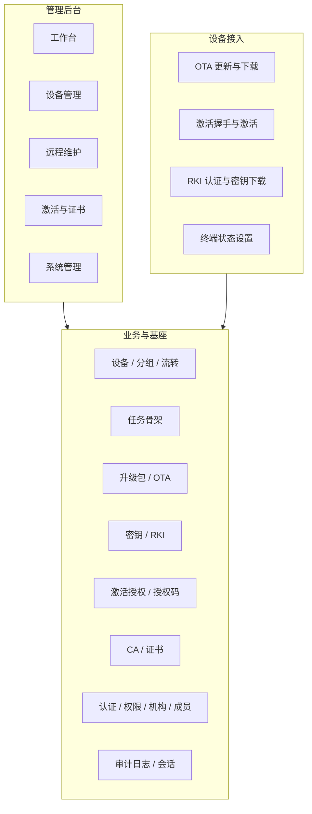

| 功能域 | 职责 | 对应菜单 |
|---|---|---|
| 工作台 | 按数据范围汇总设备、激活、任务与运维提醒 | 工作台 |
| 设备管理 | 设备主数据、分组、入出库流转、设备模式任务 | 设备列表、设备分组、流转记录、设备模式任务 |
| 远程维护 | 升级内容与版本、OTA 任务、密钥导入、RKI 任务及两类执行记录 | 升级包管理、OTA 任务、OTA 执行记录、密钥管理、RKI 任务、RKI 执行记录 |
| 激活与证书 | 人员激活资格、一次性授权码、激活记录、CA 与两类证书 | 激活授权、授权码记录、设备激活记录、CA 管理、设备证书、平台服务证书 |
| 系统管理 | 客户与功能授权、机构、成员、角色权限、产品型号、三类日志与在线会话 | 客户管理、机构管理、成员管理、角色管理、产品与型号、操作日志、登录日志、在线会话 |
| 设备接入 | 设备侧 TCP 协议服务，承载 OTA、激活、RKI 三条流程 | 无菜单 |

### 2.2 系统整体架构

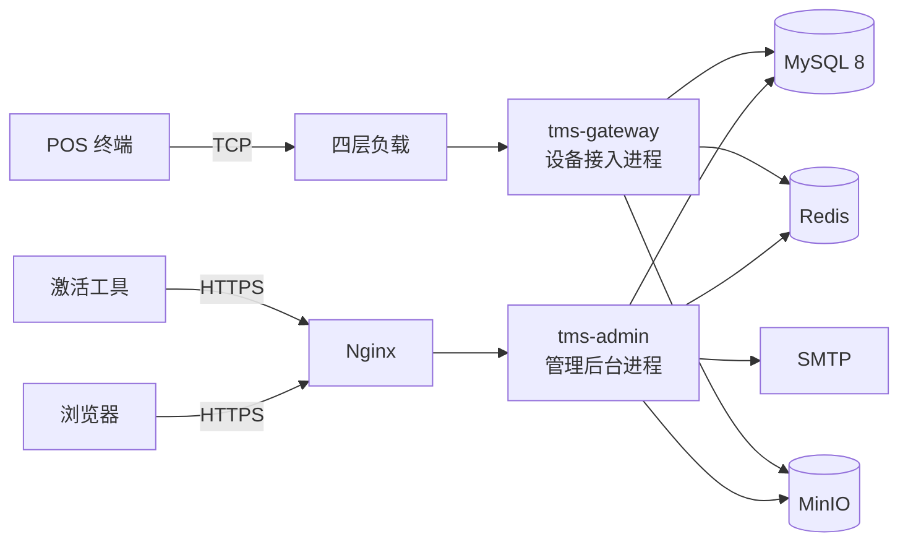

| 组件 | 职责 |
|---|---|
| `tms-admin` | 管理后台 HTTP 接口、权限与数据范围校验、工作台统计、定时任务（日活汇总、会话与授权码清理、证书到期扫描） |
| `tms-gateway` | Netty TCP 服务，报文编解码、LRC 校验、命令路由、设备侧业务处理、报文记录异步落库 |
| MySQL 8 | 全部业务数据 |
| Redis | 登录会话、握手与认证会话上下文、授权码原子占用、首页短缓存、分布式锁 |
| MinIO | 升级包文件、导入文件、导出文件 |
| SMTP | 找回密码、授权码 `email` 渠道发放 |

两个进程共享同一套业务模块与同一个数据库，按流量模型与故障域分开部署：管理后台是人操作的低频请求，设备接入是十万级终端的周期性轮询与密码学运算密集型请求，互不影响。

**设备接入的连接模型**：OTA 的 10／11／12／13 为独立请求，可短连接；激活的 A0→A1、RKI 的 A2→A3 必须在同一条 TCP 连接内完成——协议规定服务器下发握手响应后 5 分钟未收到激活请求即断开并清除握手数据，认证完成后 10 分钟未完成密钥下载即销毁密钥。因此接入层按连接维持会话上下文，Redis 作为备份与跨实例兜底；多实例部署下由 TCP 连接本身保证粘性，不需要额外路由。

### 2.3 技术选型

| 层次 | 技术 | 用途 |
|---|---|---|
| 运行环境 | JDK 17 | 后端运行时 |
| 后端框架 | Spring Boot 3.2 | 依赖注入、Web、配置、定时任务 |
| 持久层 | MyBatis-Plus 3.5 | 单表 CRUD、分页、逻辑删除、SQL 拦截器（租户与数据范围） |
| 数据库 | MySQL 8.0（InnoDB，utf8mb4） | 业务数据，报文记录按日分区 |
| 缓存 | Redis 7 | 会话、握手上下文、授权码占用、短缓存、分布式锁 |
| 对象存储 | MinIO（S3 协议） | 升级包与导入导出文件 |
| 设备接入 | Netty 4.1 | TCP 服务与自定义报文编解码 |
| 密码学 | BouncyCastle 1.78 | RSA-2048 PKCS#1 v1.5、AES、CMAC、SHA-256、X.509 证书签发、TR-31 |
| 接口文档 | SpringDoc OpenAPI 3 | 管理后台接口文档 |
| 表格处理 | EasyExcel 3.3 | 批量入库、密钥文件、列表导出 |
| 前端 | Vue 3 + TypeScript + Vite + Element Plus + Pinia | 管理后台页面 |
| 构建 | Maven 3.9 | 后端多模块构建 |

不引入消息队列：设备侧为请求-响应模型，任务派发由设备主动查询触发，10 万台规模下 DB 查询加乐观锁足以承载；报文记录用有界队列异步批量写入，写入失败不影响设备交互（详见 7.11）。

### 2.4 系统角色与权限

有效权限由三个条件共同决定，缺一不可：

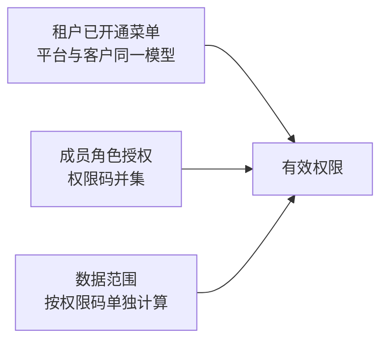

| 条件 | 说明 |
|---|---|
| 租户已开通菜单 | 平台与客户都是租户，都有功能授权记录；平台默认开通全部菜单，客户在创建时分配，详见 3.3 |
| 成员角色授权 | 成员多个角色的权限码取并集，详见 3.2 |
| 数据范围 | 仅成员所属机构／成员所属机构及下级，按权限码单独计算，不跨角色拼接，详见 7.1 |

菜单与操作对平台、客户的适用性由权限目录的 `platform_only` 字段承载（6.2.1），不是代码中的硬编码名单；运行时平台与客户走完全相同的计算路径，没有按账户类型分支的逻辑。

**默认角色**

| 角色 | 账户边界 | 默认数据范围 | 说明 |
|---|---|---|---|
| 平台管理员 | 平台 | 成员所属机构及下级 | 内置，不可编辑、停用、删除 |
| 客户管理员 | 客户 | 成员所属机构及下级 | 内置，权限受客户功能授权上限约束 |
| 机构管理员 | 客户 | 成员所属机构及下级 | 内置 |

密钥操作员、只读查看等身份通过自定义角色配置，不增加内置角色和独立首页。

### 2.5 工程结构与模块划分

#### 2.5.1 仓库结构

```text
tms-project/
├── CLAUDE.md                  工程约定与开发规范
├── docs/
│   ├── TMS-详细设计.md         本文档
│   ├── TMS-功能清单.md         业务规则来源
│   └── protocol/              设备侧 TCP 协议规范
├── prototype/                 低保真原型
├── zx-tms/                    后端，Maven 聚合工程
└── tms-web/                   前端，Vue 3
```

#### 2.5.2 后端模块

```text
zx-tms/
├── pom.xml                 父 POM，统一依赖版本
├── tms-common/             通用契约、Result、异常、错误码、分页、ID、时间工具
├── tms-crypto/             RSA / AES / CMAC / KCV / TR-31 / LRC / 签名验签
├── tms-infra/              DB / Redis / MinIO / Mail / Lock / MyBatis 技术组件
├── tms-task/               通用任务、Assignment、Attempt、任务状态机
├── tms-core/               iam / audit / product / device / cert
├── tms-activation/         激活握手、激活会话、设备初始化
├── tms-ota/                升级包、OTA 任务、查询 / 下载 / 上报
├── tms-rki/                RKI 认证、密钥交换、下载、断点续传
├── tms-admin/              【可执行】Spring Boot 管理后台
└── tms-gateway/            【可执行】TCP 设备接入
```

| 模块 | 职责 | 依赖 |
|---|---|---|
| `tms-common` | `Result`、业务异常、错误码、分页对象、BaseEntity、脱敏、雪花 ID、UTC 时间工具 | — |
| `tms-crypto` | `CryptoService` 抽象与软件实现：RSA-2048 PKCS#1 v1.5 签名与加解密、AES、CMAC、KCV、TR-31 密钥块、LRC、XOR。零业务依赖，接入加密机时只替换实现类 | common |
| `tms-infra` | 数据源与 MyBatis-Plus 配置、Redis、`FileStorage`（MinIO）、邮件、分布式锁、租户与数据范围 SQL 拦截器、请求上下文 | common |
| `tms-task` | 任务骨架：任务、执行项（Assignment）、执行尝试（Attempt）、任务状态机、发布与停止、冲突校验。被 OTA、RKI、设备模式任务复用 | infra |
| `tms-core` | 稳定核心与主数据：`iam`（租户／机构／成员／角色／权限／认证会话）、`audit`（操作日志／登录日志／在线会话／接口访问日志／设备报文记录）、`product`（产品与型号）、`device`（设备／分组／流转／变更记录／设备模式任务）、`cert`（CA／设备证书／平台服务证书） | task、crypto |
| `tms-activation` | 激活授权、一次性授权码、A0／A1 激活会话、设备初始化与证书下发 | core |
| `tms-ota` | 升级内容与版本、OTA 任务、执行记录、命令码 10／11／12／13 的业务处理 | core、task |
| `tms-rki` | 密钥材料导入与存储、RKI 任务、命令码 A2／A3 的认证与密钥下载、断点续传、执行记录 | core、task |
| `tms-admin` | 管理后台 HTTP 接口、权限 AOP、工作台统计聚合、定时任务 | 全部业务模块 |
| `tms-gateway` | Netty TCP 接入、报文编解码、命令路由 | activation、ota、rki |

依赖方向严格单向，无环：

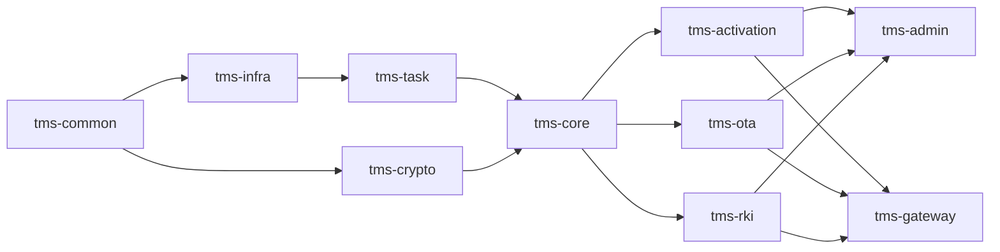

#### 2.5.3 模块内部包结构

```text
com.zxinfotek.tms.{module}
├── api/            对外 Service 接口与 DTO —— 唯一允许被其他模块引用的包
├── entity/         数据库实体
├── mapper/         MyBatis Mapper
├── service/impl/   业务实现
├── enums/          模块内枚举
└── converter/      Entity 与 DTO 转换
```

`tms-core` 内各域（`iam`、`audit`、`product`、`device`、`cert`）按同样结构分包，跨域同样只允许引用对方 `api` 包。

#### 2.5.4 跨模块协作约束

以下两条决定该结构能否长期维持，也决定后期能否平滑拆分服务，详见 7.12：

1. **`tms-task` 不得依赖 `tms-core`**。执行项只持有 `device_id` 与 `org_path`，不引用设备实体；需要设备信息时由 task 定义 `TaskTargetResolver` 接口、各业务域实现并注入。否则 `tms-core`（设备模式任务复用任务状态机）与 `tms-task`（执行项关联设备）立即形成循环依赖。
2. **禁止跨模块 SQL join 与跨模块事务**。跨域取数只走对方 `api` 包的 Service 接口；列表页需要跨域字段时先查主表，再按 ID 批量补全。

#### 2.5.5 后期拆分服务路径

`tms-activation`、`tms-ota`、`tms-rki` 已是互不依赖的独立模块，需要独立部署时为其增加 Spring Boot 启动类与网关路由即可，业务代码不动；`tms-core.iam` 可进一步抽为独立的用户权限中心。前提是 2.5.4 两条约束从第一天起执行。

#### 2.5.6 前端目录

```text
tms-web/src/
├── api/          按模块封装的请求方法
├── components/   机构树选择器、设备选择器、权限目录表格、批量结果面板等共用组件
├── directives/   v-perm 权限指令
├── layouts/      主框架：侧边菜单、面包屑、全局搜索、消息通知
├── router/       路由与菜单元数据，绑定权限码
├── stores/       Pinia：user / permission / dict
├── utils/
└── views/        dashboard / device / maintain / activation / system
```

---

## 3. 功能详细设计

本章 3.1～3.8 为系统基座，本轮完整展开；3.9～3.20 为业务模块，本轮只列职责与归属模块。

### 3.1 认证与会话

#### 3.1.1 功能说明

管理成员的登录认证与登录会话，提供令牌签发、请求鉴权、会话失效与强制下线能力。

#### 3.1.2 页面与操作

| 页面 | 页面职责 | 主要操作 | 使用角色 |
|---|---|---|---|
| 登录页 | 账号密码登录，展示登录失败原因 | 登录、找回密码 | 全部 |
| 首次改密页 | 首次登录或管理员重置密码后强制修改 | 修改密码 | 全部 |
| 个人中心 | 维护昵称、邮箱、联系电话与个人密码 | 保存资料、修改密码、验证邮箱 | 全部 |

#### 3.1.3 核心流程

**登录**

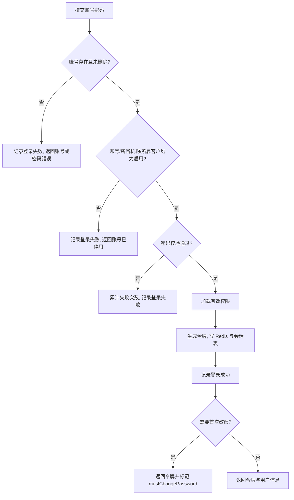

**请求鉴权**

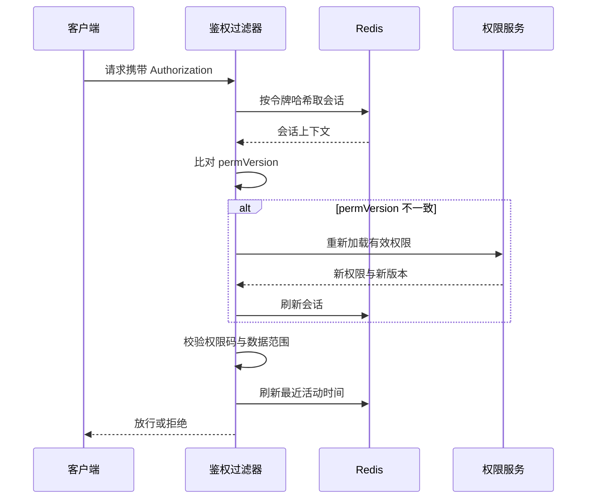

**会话失效**：退出登录、强制下线、账号停用、管理员重置密码、修改本人密码、所属客户或机构停用、成员删除，均删除对应 Redis 键并将会话表记录置为已失效，写入失效原因。

#### 3.1.4 状态设计

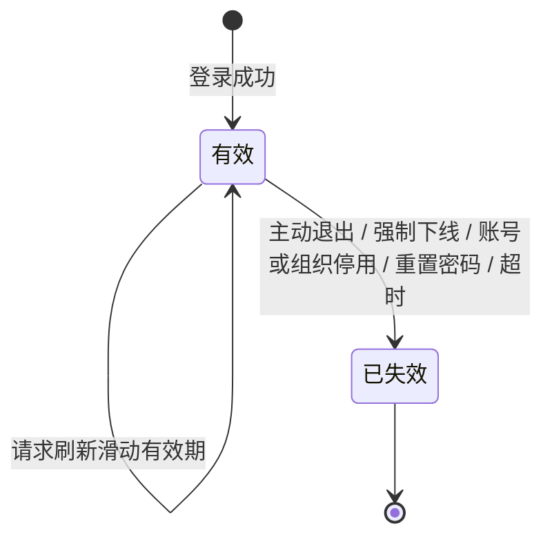

会话状态取值见 6.2.4，失效原因见 6.2.5。

#### 3.1.5 业务规则

1. 令牌为 32 字节安全随机数的 Base64URL 串，服务端按 `SHA-256(令牌)` 作为 Redis 键，不存明文令牌。
2. 不使用无状态 JWT：在线会话列表、强制下线、停用账号即时失效要求服务端可随时撤销单个会话。
3. 会话滑动有效期默认 30 分钟，绝对有效期默认 12 小时，两者均可配置；达到任一上限即失效，失效原因为超时。
4. 会话入口分为 `console`（管理后台）与 `tool`（激活工具），同一账号可同时存在多条会话，不做单点互踢。
5. 密码使用 BCrypt 存储，强度因子 10；不保存明文或可逆密文。
6. 连续登录失败 5 次锁定账号 15 分钟，锁定期间登录直接失败并记录登录日志；成功登录清零计数。
7. 登录成功后加载有效权限并写入会话上下文，结构为 `权限码 → 数据范围`，计算方式见 7.1。
8. 权限相关数据变更时自增对应版本号，会话校验发现版本不一致即重新加载权限，不等待会话过期，详见 7.2。
9. 首次登录与管理员重置密码后 `must_change_password` 为真，除改密和退出外的接口一律拒绝。
10. 找回密码仅对已验证邮箱的账号可用；无邮箱成员由有权限的管理员重置密码。
11. 登录成功与失败均写登录日志（3.7），登录日志只读保留。

#### 3.1.6 异常场景

| 异常场景 | 系统处理 |
|---|---|
| 账号不存在或密码错误 | 统一返回“账号或密码错误”，不区分二者；记录登录失败 |
| 账号、所属机构或所属客户已停用 | 返回账号已停用；同时失效该账号全部会话 |
| 账号处于锁定期 | 返回锁定剩余时间，不校验密码 |
| 令牌不存在或已失效 | 返回 401，客户端跳转登录页 |
| 令牌有效但权限已被收回 | 按新权限校验，返回 403 |
| Redis 不可用 | 鉴权直接失败返回 503，不降级为放行 |

#### 3.1.7 幂等与并发

- 重复提交登录请求各自生成独立会话，不做合并；会话数量由绝对有效期与清理任务收敛。
- 强制下线与自然过期并发时以删除 Redis 键为准，会话表按 `状态 = 有效` 条件更新，重复执行不覆盖已有失效原因。
- 权限重载使用按成员维度的分布式锁，避免高并发下重复加载。

#### 3.1.8 涉及数据与接口

数据：`t_member`（4.3.4）、`t_login_session`（4.3.9）、`t_login_log`（4.3.10）。  
接口：5.3。  
技术机制：会话失效与权限变更传播见 7.2。

---

### 3.2 权限与角色

#### 3.2.1 功能说明

维护系统权限目录与角色，决定成员能访问哪些菜单、执行哪些操作、看到哪些机构的数据。

#### 3.2.2 页面与操作

| 页面 | 页面职责 | 主要操作 | 必要权限 |
|---|---|---|---|
| 角色管理 | 查询本机构及下级可见角色，展示归属机构与可管理范围 | 新增、编辑、复制、启停、删除 | `roles:view` `roles:create` `roles:edit` `roles:toggle` `roles:copy` `roles:delete` |
| 角色权限配置 | 按菜单分组平铺展示权限目录，逐项勾选操作 | 保存权限 | `roles:edit` |

权限配置按菜单分组平铺，每行一个菜单、行内是该菜单可配置的操作，不采用可折叠树。

#### 3.2.3 核心流程

**有效权限计算**

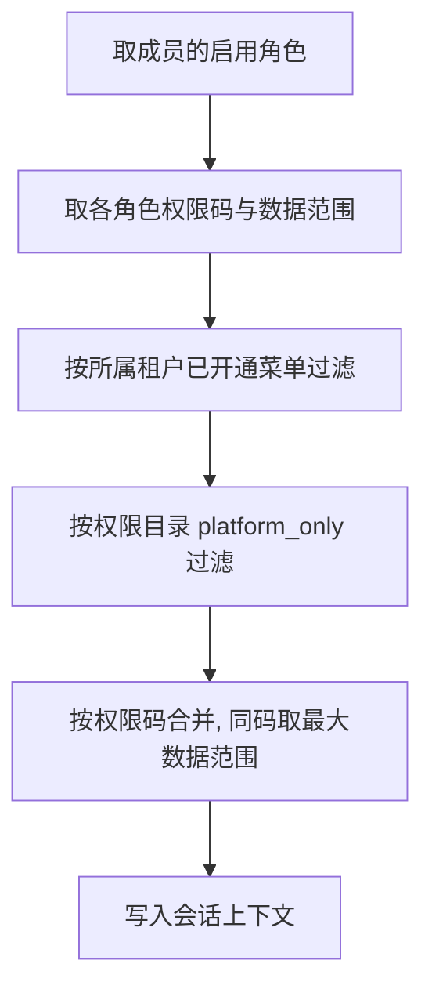

平台与客户共用该流程：平台租户的已开通菜单为全部 25 项，`platform_only` 过滤对平台不生效。

**可授予权限计算**：操作者新建或编辑角色时，可勾选集合 = 操作者自身有效权限 ∩ 目标租户已开通菜单的权限码 ∩ 权限目录允许该租户使用的权限码。目标角色已有但操作者无权维护的权限项保留且只读。

#### 3.2.4 状态设计

角色状态为启用、停用，取值见 6.2.6。停用角色不参与有效权限计算，重新启用后自动恢复。

#### 3.2.5 业务规则

1. 权限目录由系统维护，来源为代码常量，服务启动时同步到 `t_permission`；不允许用户自建权限码或填写权限编码。
2. 权限码格式为 `菜单键:操作`，菜单与操作清单见 6.2.2。
3. 菜单与操作对平台、客户的适用性由权限目录的 `platform_only` 字段决定（6.2.1）；`platform_only = 1` 的权限码在客户角色页面直接隐藏。代码中不得出现硬编码菜单名单。
4. `platform_only` 是权限码级而非菜单级：设备菜单客户可见，但其中的入库、出库、退货回收三项操作仅平台可配置，客户账户只有查看、转移、报废、导出。
5. 同一机构内角色名称唯一。
6. 归属机构是创建并维护该角色的机构，只有该机构有权限的成员可以编辑；可管理范围是持有该角色的成员能访问的机构范围，取值为仅成员所属机构、成员所属机构及下级，默认后者。
7. 勾选任一业务操作时自动勾选该菜单的查看权限；取消查看时同步取消该菜单下可编辑的操作权限；保存时再次校验依赖。
8. 只能新增或移除操作者当前有权授予的权限；复制角色时只带入当前可授予部分。
9. 内置角色（平台管理员、客户管理员、机构管理员）不提供编辑、启停和删除，列表中标注“内置”。
10. 新增系统功能产生的新权限码纳入权限目录并自动加入内置管理员角色，不自动授予已有自定义角色。内置平台管理员覆盖权限目录的全部权限码，含 `keys`、`rki`、`rki-records` 三个菜单；客户侧内置角色（客户管理员、机构管理员）仍不含这三个菜单，客户人员操作支付密钥必须由自定义角色显式授予（7.3）。
11. 角色被成员引用时不能删除，只能停用。
12. 角色权限或状态变更后自增该角色的权限版本，受影响成员的下一次请求按新权限校验。
13. 不得移除本机构最后一名管理员的必要管理权限。必要管理权限指 `members:edit` 与 `members:assign`；任何角色或成员改动生效后，机构内必须仍有至少一名启用成员同时持有这两项，否则整体拒绝。
14. 内置角色的权限码由权限目录推导，不单独维护清单：

| 内置角色 | 权限构成 | 数据范围 |
|---|---|---|
| 平台管理员 `PLATFORM_ADMIN` | 权限目录的全部权限码（120 项） | 成员所属机构及下级 |
| 客户管理员 `TENANT_ADMIN` | 全部 `platform_only = 0` 的权限码，去除 `keys`、`rki`、`rki-records` 三个菜单（71 项） | 成员所属机构及下级 |
| 机构管理员 `BRANCH_ADMIN` | 客户管理员的权限码再去除 `roles` 菜单（角色目录由客户管理员维护，64 项） | 成员所属机构及下级 |

平台内置角色在服务启动时同步；客户与机构内置角色在创建客户时按客户根机构创建，归属机构为客户根机构，因而对该客户下各级机构均可分配。权限目录或内置角色构成调整后，服务启动时按上表规则重算全部已存在内置角色的权限码，变更的角色自增权限版本，在线成员下一次请求即按新权限校验。

#### 3.2.6 异常场景

| 异常场景 | 系统处理 |
|---|---|
| 提交了操作者无权授予的权限码 | 整体拒绝，返回越权的权限码清单 |
| 提交了客户未开通功能的权限码 | 整体拒绝，提示该功能未对客户开通 |
| 勾选操作但未勾选查看 | 服务端自动补齐查看权限后保存 |
| 角色名称重复 | 拒绝保存，提示名称已存在 |
| 删除被成员引用的角色 | 拒绝删除，返回引用成员数量 |
| 编辑内置角色 | 拒绝，返回内置角色不可修改 |

#### 3.2.7 幂等与并发

- 权限目录同步按权限码 `INSERT ... ON DUPLICATE KEY UPDATE`，重复启动结果一致；目录中已不存在的权限码标记为停用而非物理删除，历史角色配置保留。
- 角色保存使用版本号乐观锁，并发编辑时后提交者收到冲突提示并需重新加载。

#### 3.2.8 涉及数据与接口

数据：`t_permission`（4.3.8）、`t_role`（4.3.5）、`t_role_perm`（4.3.6）、`t_member_role`（4.3.7）。  
接口：5.4。  
技术机制：数据权限控制见 7.1，权限变更传播见 7.2。

---

### 3.3 客户与功能授权

#### 3.3.1 功能说明

管理客户（租户）档案、客户可用产品型号与可用功能菜单上限。

#### 3.3.2 页面与操作

| 页面 | 页面职责 | 主要操作 | 必要权限 |
|---|---|---|---|
| 客户管理 | 查询客户，展示联系信息、关联型号与状态 | 新增、编辑、启停、删除、功能授权、导出 | `customers:*` |
| 功能授权 | 配置该客户可用的菜单上限 | 保存授权 | `customers:authorize` |

#### 3.3.3 核心流程

**创建客户**：填写客户资料与关联型号 → 创建客户记录 → 创建该客户的根机构 → 创建客户管理员成员并分配内置客户管理员角色 → 按本次勾选的菜单写入功能授权。四步在同一事务内完成。

可勾选菜单为权限目录中存在至少一个 `platform_only = 0` 权限码的菜单，共 20 个；`home` 强制包含且不可取消。

#### 3.3.4 状态设计

客户状态为启用、停用，取值见 6.2.6。停用客户限制本客户及下级机构人员访问并使其会话失效，不自动停止已发布任务、不自动锁定设备。

#### 3.3.5 业务规则

1. 客户名称在平台内唯一。
2. 客户不保留联系邮箱属性；客户管理员的个人邮箱在成员管理中维护。
3. 客户与其根机构一一对应，根机构 `org_type` 为客户根机构，`parent_id` 为平台根机构。
4. 平台为固定客户（租户编号 0），根机构名称恒为“平台”，不随部署方公司名称变化。平台租户同样有功能授权记录，初始化为全部 25 个菜单，页面不提供平台功能授权入口。
5. 客户可关联多个产品型号；存在归属设备或业务引用的型号不能取消关联。
6. 功能授权可选项为权限目录中存在至少一个 `platform_only = 0` 权限码的菜单（共 20 个，见 6.2.1），工作台始终保留且不可取消。
7. 功能授权是该客户的权限上限，成员实际权限还需角色授权。
8. 关闭功能后限制新的访问与操作，保留业务数据与角色配置，不自动停止已发布任务；再次开通后原角色中保留的授权恢复生效。
9. 存在设备、任务或下级机构的客户不能删除。
10. 功能授权变更后自增该客户的功能版本，受影响成员的下一次请求按新范围校验。

#### 3.3.6 异常场景

| 异常场景 | 系统处理 |
|---|---|
| 客户名称重复 | 拒绝保存 |
| 取消关联仍有归属设备的型号 | 拒绝保存，返回该型号的设备数量 |
| 删除存在设备、任务或下级机构的客户 | 拒绝删除，返回阻断原因 |
| 停用客户 | 本客户及下级机构成员会话全部失效，失效原因为组织停用 |
| 客户管理员账号已存在 | 拒绝创建，提示更换账号 |

#### 3.3.7 幂等与并发

创建客户的四步在同一事务内完成，任一步失败整体回滚；客户名称与管理员账号均有数据库唯一约束兜底。

#### 3.3.8 涉及数据与接口

数据：`t_tenant`（4.3.1）、`t_tenant_feature`（4.3.2）、`t_tenant_model`（4.3.15）、`t_org`（4.3.3）、`t_member`（4.3.4）。  
接口：5.5。  
技术机制：租户隔离见 7.3。

---

### 3.4 机构管理

#### 3.4.1 功能说明

维护客户内部的多级机构树，机构是设备归属、数据范围和任务维护权的基准单位。

#### 3.4.2 页面与操作

| 页面 | 页面职责 | 主要操作 | 必要权限 |
|---|---|---|---|
| 机构管理 | 左侧机构树按层级展示权限范围内机构，右侧列出机构明细 | 新增、编辑、启停、删除、创建子机构及其管理员、导出 | `orgs:*` |

树节点点击筛选该机构及下级，再次点击恢复全部；右侧记录数行前缀当前范围。

#### 3.4.3 核心流程

**创建子机构**：选择上级机构 → 校验上级可管理且已启用 → 生成机构记录并按上级 `org_path` 拼接本级路径 → 同事务创建管理员成员并分配角色（角色权限不得超过创建方可授予范围）。

#### 3.4.4 状态设计

机构状态为启用、停用，取值见 6.2.6。停用机构限制本机构及下级人员访问并使其会话失效。

#### 3.4.5 业务规则

1. 机构树用物化路径 `org_path` 表示层级，格式为 `/根机构ID/.../本级ID/`，创建时由上级路径拼接生成。
2. 同一上级下机构名称唯一。
3. 上级机构只能选择操作者可管理且已启用的机构，不允许跨客户选择或手工输入机构编号。
4. 本期不通过普通编辑变更既有机构的上级归属。
5. 存在成员、设备、任务或下级机构的机构不能删除。
6. 平台根机构与客户根机构不可删除、不可停用。
7. 新建子机构时同时创建其管理员账户；本期不提供邮件邀请方式。
8. 机构停用不影响已发布任务与设备状态，恢复后不自动恢复被单独停用的成员。

#### 3.4.6 异常场景

| 异常场景 | 系统处理 |
|---|---|
| 同级机构名称重复 | 拒绝保存 |
| 选择的上级机构已停用或超出可管理范围 | 拒绝保存，提示重新选择 |
| 删除存在成员、设备、任务或下级机构的机构 | 拒绝删除，返回阻断项与数量 |
| 停用机构 | 本机构及下级成员会话全部失效 |

#### 3.4.7 幂等与并发

机构创建与其管理员创建在同一事务内完成；主键由雪花算法在插入前生成，`org_path` 由上级路径拼接本级主键后随记录一次写入，不存在中间可见状态。

#### 3.4.8 涉及数据与接口

数据：`t_org`（4.3.3）、`t_member`（4.3.4）。  
接口：5.6。  
技术机制：数据权限控制见 7.1。

---

### 3.5 成员与账号

#### 3.5.1 功能说明

管理系统成员的登录账号、所属机构、角色分配与账号生命周期。

#### 3.5.2 页面与操作

| 页面 | 页面职责 | 主要操作 | 必要权限 |
|---|---|---|---|
| 成员管理 | 按机构、账号、状态查询成员，展示角色与状态 | 新增、编辑、启停、删除、重置密码、分配角色、导出 | `members:*` |

#### 3.5.3 核心流程

**新增成员**：校验账号唯一与格式 → 校验目标机构在可管理范围内 → 校验待分配角色均在操作者可授予范围内 → 生成随机初始密码 → 创建成员并置 `must_change_password` → 返回初始密码供管理员转交。

#### 3.5.4 状态设计

成员状态为启用、停用，取值见 6.2.6。停用成员限制登录与访问，并使其全部会话失效。

#### 3.5.5 业务规则

1. 登录账号必填，在系统实例内唯一，创建后普通编辑不能更改；限制为 3 至 64 位字母、数字、点、下划线或短横线，统一转小写判重。
2. 邮箱选填；填写时校验格式与唯一绑定，通知和自助找回密码前须完成验证；更换邮箱不改变账号、成员编号与历史操作归属。
3. 无邮箱成员可用账号密码登录，由有权限的管理员重置密码，自助邮件找回不适用。
4. 新增和编辑均至少选择一个角色，支持多选；可分配角色按目标机构、客户功能上限与操作者可授予权限过滤。
5. 所属机构使用机构树选择，创建后不通过普通成员编辑跨机构移动人员。
6. 初始密码由系统生成随机值，首次登录强制修改；管理员不自行设定密码。
7. 不能增减操作者无权分配的角色；成员已有的更高权限角色保持只读。
8. 不得移除本机构最后一名有效管理员的必要管理权限。
9. 停用账号、删除成员、管理员重置密码均使该成员现有登录会话失效。
10. 成员删除为逻辑删除，保留历史操作归属；存在业务归属引用时不影响历史记录展示。

#### 3.5.6 异常场景

| 异常场景 | 系统处理 |
|---|---|
| 账号已存在 | 拒绝创建，提示更换账号 |
| 账号格式不合法 | 拒绝创建，返回格式要求 |
| 邮箱已被其他成员绑定 | 拒绝保存 |
| 分配了操作者无权授予的角色 | 拒绝保存，返回越权角色名称 |
| 未选择任何角色 | 拒绝保存 |
| 移除本机构最后一名管理员权限 | 拒绝保存 |

#### 3.5.7 幂等与并发

账号唯一性以数据库唯一索引兜底（小写账号列）；重复提交创建请求只有一次成功。角色分配为全量覆盖，按成员维度加行锁后先删后插，避免并发分配产生重复关系。

#### 3.5.8 涉及数据与接口

数据：`t_member`（4.3.4）、`t_member_role`（4.3.7）。  
接口：5.7。

---

### 3.6 操作日志与审计

#### 3.6.1 功能说明

以可识别的业务操作为记录单位保存审计日志，并单独记录接口访问日志，两者用同一关联编号串联。

#### 3.6.2 页面与操作

| 页面 | 页面职责 | 主要操作 | 必要权限 |
|---|---|---|---|
| 操作日志 | 按业务模块、操作类型、人员、对象、时间与结果查询 | 查看详情、导出 | `logs:view` `logs:export` |

不提供普通用户修改或删除日志的入口。

#### 3.6.3 核心流程

业务方法执行完毕后由切面收集操作主体、模块、操作类型、业务对象、结果与变更摘要，异步写入操作日志；接口访问日志由过滤器在响应完成后写入。两者共用同一 `trace_id`。

#### 3.6.4 业务规则

1. 记录单位是业务操作，不是接口调用；上传、校验、保存等多接口流程围绕业务提交结果记录一条。
2. 业务模块使用稳定模块编码（6.2.7），与一级功能菜单对应，菜单改名不改变历史归类。
3. 操作类型为独立字段，取值见 6.2.8。
4. 业务对象保存对象类型、编号与当时名称，对象改名后历史记录仍可解释。
5. 操作主体记录账号、昵称、所属客户与机构、操作时间、来源 IP。
6. 操作结果记录服务端实际的成功、失败或部分成功及失败原因；拒绝授权等安全事件保留记录。
7. 变更内容按字段白名单记录变更前后摘要，敏感字段脱敏。
8. 批量出库、转移等批量业务记录一条操作摘要并关联批次号，不把每台设备平铺成一条主日志。
9. 发布类异步操作只表示发布成功，逐台执行结果进入对应执行记录，不解释为设备执行成功。
10. 普通列表翻页与筛选不记录操作日志；敏感详情访问、数据导出、权限与密钥相关操作必须记录。
11. 不记录密码、完整授权码、会话令牌、私钥、支付密钥明文与上传文件原文，详见 7.6。
12. 日志按操作者数据范围查询与导出。

#### 3.6.5 异常场景

| 异常场景 | 系统处理 |
|---|---|
| 日志写入失败 | 记录错误日志，不影响主业务事务 |
| 业务执行失败 | 仍写入操作日志，结果为失败并记录原因 |
| 变更摘要超长 | 按字段白名单截断，保留关键字段 |

#### 3.6.6 幂等与并发

操作日志按 `trace_id` + 模块 + 操作类型去重；异步队列满时丢弃接口访问日志而非业务操作日志，并输出告警。

#### 3.6.7 涉及数据与接口

数据：`t_oper_log`（4.3.11）、`t_api_access_log`（4.3.12）。  
接口：5.8。  
技术机制：关联编号见 7.5，敏感数据保护见 7.6。

---

### 3.7 登录日志与在线会话

#### 3.7.1 功能说明

登录日志保留历史登录记录，在线会话展示当前仍然有效的登录并提供强制下线。

#### 3.7.2 页面与操作

| 页面 | 页面职责 | 主要操作 | 必要权限 |
|---|---|---|---|
| 登录日志 | 查询账号、机构、登录时间、成功或失败、失败原因、IP、浏览器与系统 | 查看、导出 | `logins:view` `logins:export` |
| 在线会话 | 每行一个有效登录会话，展示账号、姓名、机构、入口、IP、客户端、登录时间、最近活动时间 | 强制下线、导出 | `sessions:view` `sessions:force` |

登录日志只读，不提供任何操作入口，也不提供跳转在线会话的入口。

#### 3.7.3 业务规则

1. 登录成功与失败均写入登录日志，失败记录失败原因。
2. 登录日志与会话之间不建立关联，不增加“是否仍在线”列。
3. 同一账号可有多条在线会话，按入口区分管理后台与激活工具。
4. 强制下线单独授权，只能处理操作者管理范围内的有效会话；填写原因并二次确认，一次只结束一条会话。
5. 不提供“结束该账号全部会话”操作；该场景由停用账号与重置密码覆盖。
6. 当前会话在账号列标注“当前会话”，操作列不提供强制下线自身的入口。
7. 强制下线后服务端使会话及其续期能力失效，后续请求要求重新登录；仅刷新前端或清除客户端缓存不算完成。
8. 强制下线不等于停用账号，账号仍可重新登录。
9. 人员下线不改变设备归属，不停止已发布任务。
10. 账号停用、重置密码、组织停用等事件使相关会话失效并记录失效原因。
11. 强制下线记录操作者、目标账号与会话编号、原因、时间与结果；列表中的会话编号不是可用于认证的令牌。

#### 3.7.4 异常场景

| 异常场景 | 系统处理 |
|---|---|
| 强制下线时会话已失效 | 返回该会话已失效，不重复写失效原因 |
| 强制下线超出管理范围的会话 | 返回 403 |
| 未填写下线原因 | 拒绝提交 |

#### 3.7.5 幂等与并发

强制下线按 `状态 = 有效` 条件更新会话表，重复提交只有第一次生效；Redis 键删除为幂等操作。

#### 3.7.6 涉及数据与接口

数据：`t_login_log`（4.3.10）、`t_login_session`（4.3.9）。  
接口：5.8。

---

### 3.8 产品与型号

#### 3.8.1 功能说明

维护产品类别、产品与型号主数据，型号用于客户授权、设备入库、升级内容适配和任务设备筛选。

#### 3.8.2 页面与操作

| 页面 | 页面职责 | 主要操作 | 必要权限 |
|---|---|---|---|
| 产品与型号 | 查询产品，展示类别、图片、描述与型号清单 | 新增、编辑、查看详情、删除、导出 | `products:*` |

#### 3.8.3 业务规则

1. 产品与型号由平台维护，客户账户不提供该菜单。
2. 产品类别取值为传统 POS、台式 POS，见 6.2.9。
3. 一个产品可包含多个型号，型号标识在平台内唯一。
4. 已被设备、客户授权或升级内容引用的型号不能移除。
5. 产品图片存入对象存储，记录访问路径，不入库存二进制。

#### 3.8.4 异常场景

| 异常场景 | 系统处理 |
|---|---|
| 型号标识重复 | 拒绝保存 |
| 未添加任何型号 | 拒绝保存 |
| 移除仍被引用的型号 | 拒绝保存，返回引用方与数量 |
| 类别不在允许取值内 | 拒绝保存 |

#### 3.8.5 涉及数据与接口

数据：`t_product`（4.3.13）、`t_product_model`（4.3.14）、`t_tenant_model`（4.3.15）。  
接口：5.5。

---

### 3.9～3.20 业务模块（下一轮展开）

| 章节 | 模块 | 职责 | 归属模块 |
|---|---|---|---|
| 3.9 | 设备列表与详情 | 设备主数据、状态与版本、六类详情记录 | `tms-core.device` |
| 3.10 | 入库、出库与流转 | 号段与批量入库、出库、转移、退货回收、报废、撤销转移 | `tms-core.device` |
| 3.11 | 设备分组 | 面向 OTA 选择目标设备的业务设备集合 | `tms-core.device` |
| 3.12 | 设备模式任务 | 平台下发调试、产品、锁定三种目标模式 | `tms-core.device` + `tms-task` |
| 3.13 | 升级包管理 | 升级内容与版本两层结构、可用范围与型号适配 | `tms-ota` |
| 3.14 | OTA 任务与执行记录 | 选内容与版本、选设备、有效期、发布停止、逐台结果 | `tms-ota` + `tms-task` |
| 3.15 | 密钥管理 | TMK／IPEK／Fixed Key 密文文件导入、分量合成与校验 | `tms-rki` |
| 3.16 | RKI 任务与执行记录 | 密钥下发任务、逐台材料绑定、执行结果 | `tms-rki` + `tms-task` |
| 3.17 | 激活授权与授权码 | 人员激活资格、一次性授权码申请与撤销 | `tms-activation` |
| 3.18 | 设备激活记录 | 三类激活的会话、步骤结果与失败原因 | `tms-activation` |
| 3.19 | CA 与证书管理 | 三类 CA、设备证书、平台服务证书 | `tms-core.cert` |
| 3.20 | 工作台 | 平台与客户两套统计、趋势图、任务列表与运维提醒 | `tms-admin` |

---

## 4. 数据库设计

### 4.1 数据库设计约定

| 项 | 约定 |
|---|---|
| 数据库 | MySQL 8.0，InnoDB，`utf8mb4` / `utf8mb4_0900_ai_ci` |
| 表命名 | 业务表 `t_` 前缀，统计表 `t_stat_` 前缀，小写下划线 |
| 字段命名 | 小写下划线；布尔语义字段用 `is_` 前缀并存 `TINYINT(1)` |
| 主键 | `id BIGINT UNSIGNED`，雪花算法生成，不使用自增（分库与数据迁移友好） |
| 时间字段 | `DATETIME(3)`，**统一存 UTC**，展示时按用户时区转换；不使用 `TIMESTAMP` |
| 公共字段 | `create_by`、`create_by_name`、`create_time`、`update_by`、`update_by_name`、`update_time`；冗余操作人姓名避免历史记录因改名失真 |
| 租户字段 | 业务数据表必须有 `tenant_id`；平台数据的 `tenant_id` 为 0 |
| 数据权限字段 | 按机构归属的业务表必须有 `org_id` 与 `org_path`，数据范围过滤走 `org_path` 前缀匹配 |
| 逻辑删除 | 主数据表用 `deleted TINYINT` 默认 0；日志、流水、记录类表不做逻辑删除。带逻辑删除且有业务唯一约束的表再加生成列 `delete_key BIGINT UNSIGNED GENERATED ALWAYS AS (IF(deleted = 0, 0, id)) STORED`，业务唯一索引用 `delete_key` 而非 `deleted` 参与，保证同一名称可被反复创建与删除 |
| 乐观锁 | 存在并发编辑的表增加 `version INT`，其余不加 |
| 外键 | 不建物理外键，关系由应用层保证 |
| 唯一约束 | 业务唯一性必须有数据库唯一索引兜底，不只依赖 Service 查询 |
| 分区 | 设备报文记录表按 `RANGE` 日分区，到期整区删除 |
| JSON | 仅用于结构不稳定的摘要类字段（如日志变更摘要），不用于需要检索的业务字段 |
| 状态字段 | 存字符串编码，取值见第 6 章，数据库不重复维护枚举 |

### 4.2 数据表清单

| 序号 | 表名 | 中文名称 | 所属模块 | 主要用途 | 本轮 |
|---|---|---|---|---|---|
| 1 | `t_tenant` | 客户（租户）表 | core.iam | 客户档案与状态 | ✅ |
| 2 | `t_tenant_feature` | 客户功能授权表 | core.iam | 客户可用菜单上限 | ✅ |
| 3 | `t_org` | 机构表 | core.iam | 平台与客户的多级机构树 | ✅ |
| 4 | `t_member` | 成员表 | core.iam | 登录账号与人员档案 | ✅ |
| 5 | `t_role` | 角色表 | core.iam | 角色定义与可管理范围 | ✅ |
| 6 | `t_role_perm` | 角色权限表 | core.iam | 角色持有的权限码 | ✅ |
| 7 | `t_member_role` | 成员角色关系表 | core.iam | 成员与角色的多对多关系 | ✅ |
| 8 | `t_permission` | 权限目录表 | core.iam | 系统权限码目录 | ✅ |
| 9 | `t_login_session` | 登录会话表 | core.iam | 在线会话查询与审计 | ✅ |
| 10 | `t_login_log` | 登录日志表 | core.audit | 历史登录记录 | ✅ |
| 11 | `t_oper_log` | 操作日志表 | core.audit | 业务操作审计 | ✅ |
| 12 | `t_api_access_log` | 接口访问日志表 | core.audit | 后台接口调用流水 | ✅ |
| 13 | `t_product` | 产品表 | core.product | 产品档案 | ✅ |
| 14 | `t_product_model` | 产品型号表 | core.product | 型号主数据 | ✅ |
| 15 | `t_tenant_model` | 客户型号授权表 | core.product | 客户可用型号 | ✅ |
| 16 | `t_device` | 设备表 | core.device | 设备主数据与当前状态 | ⬜ |
| 17 | `t_device_change` | 设备变更记录表 | core.device | 版本与状态变更 | ⬜ |
| 18 | `t_device_message` | 设备报文记录表 | core.audit | 设备交互报文，日分区保留 30 天 | ⬜ |
| 19 | `t_device_group` / `t_device_group_ref` | 设备分组表 / 分组关联表 | core.device | 分组及其设备关联 | ⬜ |
| 20 | `t_stock_batch` / `t_stock_item` | 流转批次表 / 流转明细表 | core.device | 入出库、转移、回收、报废 | ⬜ |
| 21 | `t_task` | 任务表 | task | OTA／RKI／模式任务主表 | ⬜ |
| 22 | `t_task_assignment` | 任务执行项表 | task | 逐台目标与当前结果 | ⬜ |
| 23 | `t_task_attempt` | 任务执行尝试表 | task | 每次领取与回传明细 | ⬜ |
| 24 | `t_pkg_content` / `t_pkg_version` | 升级内容表 / 升级版本表 | ota | 升级包两层结构 | ⬜ |
| 25 | `t_key_batch` / `t_key_item` | 密钥批次表 / 密钥材料表 | rki | 密钥导入与逐台材料 | ⬜ |
| 26 | `t_activation_grant` | 激活授权表 | activation | 人员激活资格 | ⬜ |
| 27 | `t_auth_code` | 授权码表 | activation | 一次性授权码 | ⬜ |
| 28 | `t_activation_record` | 激活记录表 | activation | 激活会话与结果 | ⬜ |
| 29 | `t_ca` | CA 表 | core.cert | 三类 CA 密钥对 | ⬜ |
| 30 | `t_device_cert` | 设备证书表 | core.cert | 设备三类证书 | ⬜ |
| 31 | `t_server_cert` | 平台服务证书表 | core.cert | 平台侧服务证书 | ⬜ |
| 32 | `t_device_active_day` | 设备日活跃明细表 | admin | 日活明细，保留 90 天 | ⬜ |
| 33 | `t_stat_device_active_daily` | 设备日活跃汇总表 | admin | 日活汇总，保留 1 年 | ⬜ |

### 4.3 数据表详细设计

#### 4.3.1 `t_tenant` 客户（租户）表

客户档案。平台自身为固定记录，`id = 0`。

| 字段名 | 类型 | 必填 | 默认值 | 说明 |
|---|---|---|---|---|
| `id` | BIGINT UNSIGNED | 是 | — | 主键，平台固定为 0 |
| `name` | VARCHAR(100) | 是 | — | 客户名称，全局唯一 |
| `root_org_id` | BIGINT UNSIGNED | 是 | — | 客户根机构 ID |
| `contact_name` | VARCHAR(50) | 否 | NULL | 联系人 |
| `contact_phone` | VARCHAR(30) | 否 | NULL | 联系电话 |
| `country` | VARCHAR(50) | 否 | NULL | 国家／地区 |
| `province` | VARCHAR(50) | 否 | NULL | 省／州 |
| `city` | VARCHAR(50) | 否 | NULL | 城市 |
| `remark` | VARCHAR(500) | 否 | NULL | 备注 |
| `status` | VARCHAR(20) | 是 | `ENABLED` | 状态，取值见 6.2.6 |
| `auth_code_channel` | VARCHAR(10) | 是 | `TOOL` | 授权码发放渠道，取值见 6.3.9 |
| `feature_version` | INT | 是 | 1 | 功能授权版本，变更时自增 |
| `deleted` | TINYINT | 是 | 0 | 逻辑删除 |
| `delete_key` | BIGINT UNSIGNED | 否 | 生成列 | `IF(deleted = 0, 0, id)`，供业务唯一索引使用 |
| 公共字段 | — | — | — | 见 4.1 |

| 索引名称 | 字段 | 类型 | 用途 |
|---|---|---|---|
| `PRIMARY` | `id` | 主键 | — |
| `uk_name` | `name`, `delete_key` | 唯一 | 客户名称唯一，已删除记录互不冲突 |

不保留客户联系邮箱字段；客户管理员邮箱在 `t_member` 维护。

平台为固定记录 `id = 0`，其功能授权初始化为全部 25 个菜单，页面不提供平台功能授权入口；平台与客户共用同一套租户模型，运行时不按账户类型分支。

#### 4.3.2 `t_tenant_feature` 客户功能授权表

客户可用菜单上限，一行一个菜单。

| 字段名 | 类型 | 必填 | 默认值 | 说明 |
|---|---|---|---|---|
| `id` | BIGINT UNSIGNED | 是 | — | 主键 |
| `tenant_id` | BIGINT UNSIGNED | 是 | — | 客户 ID |
| `menu_key` | VARCHAR(40) | 是 | — | 菜单键，取值见 6.2.2 |
| `create_time` | DATETIME(3) | 是 | — | 开通时间 |

| 索引名称 | 字段 | 类型 | 用途 |
|---|---|---|---|
| `uk_tenant_menu` | `tenant_id`, `menu_key` | 唯一 | 防重复开通 |

关闭功能时删除对应行，角色中的权限配置保留；再次开通后原授权自动恢复生效。

**平台租户（`tenant_id = 0`）同样有记录**，初始化写入全部 25 个菜单，系统升级新增菜单时自动补写。这样有效权限计算对平台与客户是同一条代码路径，不需要按账户类型跳过功能上限校验。

#### 4.3.3 `t_org` 机构表

平台与各客户的多级机构树。

| 字段名 | 类型 | 必填 | 默认值 | 说明 |
|---|---|---|---|---|
| `id` | BIGINT UNSIGNED | 是 | — | 主键 |
| `tenant_id` | BIGINT UNSIGNED | 是 | — | 所属客户，平台为 0 |
| `parent_id` | BIGINT UNSIGNED | 是 | 0 | 上级机构，根机构为 0 |
| `org_path` | VARCHAR(255) | 是 | — | 物化路径 `/根ID/.../本级ID/` |
| `org_type` | VARCHAR(20) | 是 | — | 机构类型，取值见 6.2.3 |
| `name` | VARCHAR(100) | 是 | — | 机构名称，同一上级下唯一 |
| `contact_name` | VARCHAR(50) | 否 | NULL | 联系人 |
| `contact_phone` | VARCHAR(30) | 否 | NULL | 联系方式 |
| `status` | VARCHAR(20) | 是 | `ENABLED` | 状态，取值见 6.2.6 |
| `deleted` | TINYINT | 是 | 0 | 逻辑删除 |
| `delete_key` | BIGINT UNSIGNED | 否 | 生成列 | `IF(deleted = 0, 0, id)`，供业务唯一索引使用 |
| 公共字段 | — | — | — | 见 4.1 |

| 索引名称 | 字段 | 类型 | 用途 |
|---|---|---|---|
| `uk_parent_name` | `parent_id`, `name`, `delete_key` | 唯一 | 同级名称唯一，已删除记录互不冲突 |
| `idx_tenant_path` | `tenant_id`, `org_path` | 普通 | 数据范围前缀查询 |
| `idx_parent` | `parent_id` | 普通 | 子机构查询与删除校验 |

平台根机构 `name` 恒为“平台”，`org_type` 为 `PLATFORM`，不可编辑名称、不可停用、不可删除。

#### 4.3.4 `t_member` 成员表

| 字段名 | 类型 | 必填 | 默认值 | 说明 |
|---|---|---|---|---|
| `id` | BIGINT UNSIGNED | 是 | — | 主键，即成员编号 |
| `tenant_id` | BIGINT UNSIGNED | 是 | — | 所属客户 |
| `org_id` | BIGINT UNSIGNED | 是 | — | 所属机构 |
| `org_path` | VARCHAR(255) | 是 | — | 所属机构路径，随机构冗余 |
| `account` | VARCHAR(64) | 是 | — | 登录账号，原样保存 |
| `account_lower` | VARCHAR(64) | 是 | — | 账号小写，用于唯一判重 |
| `nickname` | VARCHAR(50) | 是 | — | 昵称／姓名 |
| `password_hash` | VARCHAR(100) | 是 | — | BCrypt 哈希 |
| `email` | VARCHAR(128) | 否 | NULL | 邮箱 |
| `email_verified` | TINYINT | 是 | 0 | 邮箱是否已验证 |
| `phone` | VARCHAR(30) | 否 | NULL | 联系电话 |
| `must_change_password` | TINYINT | 是 | 1 | 是否需要强制改密 |
| `password_updated_at` | DATETIME(3) | 否 | NULL | 最近改密时间 |
| `fail_count` | INT | 是 | 0 | 连续登录失败次数 |
| `locked_until` | DATETIME(3) | 否 | NULL | 锁定截止时间 |
| `perm_version` | INT | 是 | 1 | 成员权限版本，角色变更时自增 |
| `status` | VARCHAR(20) | 是 | `ENABLED` | 状态，取值见 6.2.6 |
| `deleted` | TINYINT | 是 | 0 | 逻辑删除 |
| `delete_key` | BIGINT UNSIGNED | 否 | 生成列 | `IF(deleted = 0, 0, id)`，供业务唯一索引使用 |
| 公共字段 | — | — | — | 见 4.1 |

| 索引名称 | 字段 | 类型 | 用途 |
|---|---|---|---|
| `uk_account` | `account_lower`, `delete_key` | 唯一 | 账号唯一（大小写不敏感），已删除记录互不冲突 |
| `uk_email` | `email`, `delete_key` | 唯一 | 邮箱唯一绑定，允许多个 NULL |
| `idx_tenant_org` | `tenant_id`, `org_path` | 普通 | 按机构范围查询成员 |

#### 4.3.5 `t_role` 角色表

| 字段名 | 类型 | 必填 | 默认值 | 说明 |
|---|---|---|---|---|
| `id` | BIGINT UNSIGNED | 是 | — | 主键 |
| `tenant_id` | BIGINT UNSIGNED | 是 | — | 所属客户 |
| `owner_org_id` | BIGINT UNSIGNED | 是 | — | 归属机构，只有该机构可编辑 |
| `owner_org_path` | VARCHAR(255) | 是 | — | 归属机构路径 |
| `name` | VARCHAR(50) | 是 | — | 角色名称，同一机构内唯一 |
| `description` | VARCHAR(200) | 否 | NULL | 说明 |
| `data_scope` | VARCHAR(20) | 是 | `ORG_AND_SUB` | 可管理范围，取值见 6.2.10 |
| `builtin_code` | VARCHAR(40) | 否 | NULL | 内置角色编码，非空表示内置角色 |
| `perm_version` | INT | 是 | 1 | 角色权限版本，权限或状态变更时自增 |
| `status` | VARCHAR(20) | 是 | `ENABLED` | 状态，取值见 6.2.6 |
| `version` | INT | 是 | 0 | 乐观锁 |
| `deleted` | TINYINT | 是 | 0 | 逻辑删除 |
| `delete_key` | BIGINT UNSIGNED | 否 | 生成列 | `IF(deleted = 0, 0, id)`，供业务唯一索引使用 |
| 公共字段 | — | — | — | 见 4.1 |

| 索引名称 | 字段 | 类型 | 用途 |
|---|---|---|---|
| `uk_org_name` | `owner_org_id`, `name`, `delete_key` | 唯一 | 同机构角色名唯一，已删除记录互不冲突 |
| `idx_tenant_path` | `tenant_id`, `owner_org_path` | 普通 | 按机构范围查询角色 |

`builtin_code` 非空的角色不提供编辑、启停与删除。

#### 4.3.6 `t_role_perm` 角色权限表

| 字段名 | 类型 | 必填 | 默认值 | 说明 |
|---|---|---|---|---|
| `id` | BIGINT UNSIGNED | 是 | — | 主键 |
| `role_id` | BIGINT UNSIGNED | 是 | — | 角色 ID |
| `perm_code` | VARCHAR(60) | 是 | — | 权限码 `菜单键:操作` |

| 索引名称 | 字段 | 类型 | 用途 |
|---|---|---|---|
| `uk_role_perm` | `role_id`, `perm_code` | 唯一 | 防重复 |

角色权限保存为全量覆盖，先删后插。

#### 4.3.7 `t_member_role` 成员角色关系表

| 字段名 | 类型 | 必填 | 默认值 | 说明 |
|---|---|---|---|---|
| `id` | BIGINT UNSIGNED | 是 | — | 主键 |
| `member_id` | BIGINT UNSIGNED | 是 | — | 成员 ID |
| `role_id` | BIGINT UNSIGNED | 是 | — | 角色 ID |

| 索引名称 | 字段 | 类型 | 用途 |
|---|---|---|---|
| `uk_member_role` | `member_id`, `role_id` | 唯一 | 防重复分配 |
| `idx_role` | `role_id` | 普通 | 角色删除前的引用校验 |

#### 4.3.8 `t_permission` 权限目录表

系统维护的权限码目录，服务启动时由代码常量同步。

| 字段名 | 类型 | 必填 | 默认值 | 说明 |
|---|---|---|---|---|
| `id` | BIGINT UNSIGNED | 是 | — | 主键 |
| `perm_code` | VARCHAR(60) | 是 | — | 权限码，全局唯一 |
| `menu_key` | VARCHAR(40) | 是 | — | 菜单键 |
| `menu_name` | VARCHAR(50) | 是 | — | 菜单名称 |
| `group_name` | VARCHAR(50) | 是 | — | 菜单分组 |
| `action` | VARCHAR(30) | 是 | — | 操作，取值见 6.2.2 |
| `action_name` | VARCHAR(30) | 是 | — | 操作名称 |
| `platform_only` | TINYINT | 是 | 0 | 是否仅平台账户可用，**权限码级**而非菜单级 |
| `sort` | INT | 是 | 0 | 排序 |
| `status` | VARCHAR(20) | 是 | `ENABLED` | 目录中已移除的权限置为停用，不物理删除 |

| 索引名称 | 字段 | 类型 | 用途 |
|---|---|---|---|
| `uk_perm_code` | `perm_code` | 唯一 | 同步时按此 upsert |
| `idx_menu` | `menu_key`, `sort` | 普通 | 页面按菜单分组展示 |
| `idx_platform_only` | `platform_only`, `menu_key` | 普通 | 计算客户功能授权可选菜单 |

`platform_only` 承载账户边界，取值清单见 6.2.1。代码中不得再维护硬编码的平台专属菜单名单；新增菜单只需在权限目录初始化数据中标注该字段。

#### 4.3.9 `t_login_session` 登录会话表

供在线会话页面查询与审计；会话有效性判定以 Redis 为准。

| 字段名 | 类型 | 必填 | 默认值 | 说明 |
|---|---|---|---|---|
| `id` | BIGINT UNSIGNED | 是 | — | 主键，即会话编号 |
| `tenant_id` | BIGINT UNSIGNED | 是 | — | 所属客户 |
| `org_id` | BIGINT UNSIGNED | 是 | — | 所属机构 |
| `org_path` | VARCHAR(255) | 是 | — | 机构路径 |
| `member_id` | BIGINT UNSIGNED | 是 | — | 成员 ID |
| `account` | VARCHAR(64) | 是 | — | 账号快照 |
| `nickname` | VARCHAR(50) | 是 | — | 昵称快照 |
| `token_hash` | CHAR(64) | 是 | — | 令牌 SHA-256 十六进制，不存明文 |
| `entry` | VARCHAR(20) | 是 | — | 会话入口，取值见 6.2.11 |
| `client_ip` | VARCHAR(45) | 是 | — | 登录 IP，兼容 IPv6 |
| `user_agent` | VARCHAR(255) | 否 | NULL | 浏览器或客户端标识 |
| `login_time` | DATETIME(3) | 是 | — | 登录时间 |
| `last_active_time` | DATETIME(3) | 是 | — | 最近活动时间 |
| `expire_time` | DATETIME(3) | 是 | — | 绝对过期时间 |
| `status` | VARCHAR(20) | 是 | `ACTIVE` | 会话状态，取值见 6.2.4 |
| `invalid_reason` | VARCHAR(30) | 否 | NULL | 失效原因，取值见 6.2.5 |
| `invalid_time` | DATETIME(3) | 否 | NULL | 失效时间 |
| `invalid_by` | BIGINT UNSIGNED | 否 | NULL | 强制下线操作人 |
| `invalid_remark` | VARCHAR(200) | 否 | NULL | 强制下线原因说明 |

| 索引名称 | 字段 | 类型 | 用途 |
|---|---|---|---|
| `uk_token_hash` | `token_hash` | 唯一 | 按令牌定位会话 |
| `idx_member_status` | `member_id`, `status` | 普通 | 账号级批量失效 |
| `idx_scope_status` | `tenant_id`, `org_path`, `status` | 普通 | 在线会话列表按数据范围查询 |

`last_active_time` 由 Redis 承载写入，按分钟节流回写数据库，避免每请求一次更新。

#### 4.3.10 `t_login_log` 登录日志表

| 字段名 | 类型 | 必填 | 默认值 | 说明 |
|---|---|---|---|---|
| `id` | BIGINT UNSIGNED | 是 | — | 主键 |
| `tenant_id` | BIGINT UNSIGNED | 是 | 0 | 所属客户，账号不存在时为 0 |
| `org_id` | BIGINT UNSIGNED | 否 | NULL | 所属机构 |
| `org_path` | VARCHAR(255) | 否 | NULL | 机构路径 |
| `member_id` | BIGINT UNSIGNED | 否 | NULL | 成员 ID，账号不存在时为空 |
| `account` | VARCHAR(64) | 是 | — | 提交的账号 |
| `entry` | VARCHAR(20) | 是 | — | 登录入口，取值见 6.2.11 |
| `result` | VARCHAR(20) | 是 | — | 登录结果，取值见 6.2.12 |
| `fail_reason` | VARCHAR(100) | 否 | NULL | 失败原因 |
| `client_ip` | VARCHAR(45) | 是 | — | 来源 IP |
| `user_agent` | VARCHAR(255) | 否 | NULL | 浏览器／系统 |
| `trace_id` | CHAR(32) | 是 | — | 关联编号 |
| `login_time` | DATETIME(3) | 是 | — | 登录时间 |

| 索引名称 | 字段 | 类型 | 用途 |
|---|---|---|---|
| `idx_account_time` | `account`, `login_time` | 普通 | 按账号查询 |
| `idx_scope_time` | `tenant_id`, `org_path`, `login_time` | 普通 | 按数据范围分页 |

#### 4.3.11 `t_oper_log` 操作日志表

| 字段名 | 类型 | 必填 | 默认值 | 说明 |
|---|---|---|---|---|
| `id` | BIGINT UNSIGNED | 是 | — | 主键 |
| `tenant_id` | BIGINT UNSIGNED | 是 | — | 操作者所属客户 |
| `org_id` | BIGINT UNSIGNED | 是 | — | 操作者所属机构 |
| `org_path` | VARCHAR(255) | 是 | — | 机构路径 |
| `member_id` | BIGINT UNSIGNED | 是 | — | 操作者 |
| `account` | VARCHAR(64) | 是 | — | 账号快照 |
| `nickname` | VARCHAR(50) | 是 | — | 昵称快照 |
| `module` | VARCHAR(40) | 是 | — | 业务模块编码，取值见 6.2.7 |
| `action` | VARCHAR(30) | 是 | — | 操作类型，取值见 6.2.8 |
| `object_type` | VARCHAR(40) | 否 | NULL | 业务对象类型 |
| `object_id` | VARCHAR(64) | 否 | NULL | 业务对象编号 |
| `object_name` | VARCHAR(200) | 否 | NULL | 操作时的对象名称 |
| `result` | VARCHAR(20) | 是 | — | 操作结果，取值见 6.2.13 |
| `fail_reason` | VARCHAR(500) | 否 | NULL | 失败原因 |
| `total_count` | INT | 否 | NULL | 批量业务总数 |
| `success_count` | INT | 否 | NULL | 批量业务成功数 |
| `change_summary` | JSON | 否 | NULL | 字段白名单内的变更前后摘要 |
| `client_ip` | VARCHAR(45) | 是 | — | 来源 IP |
| `trace_id` | CHAR(32) | 是 | — | 关联编号 |
| `oper_time` | DATETIME(3) | 是 | — | 操作时间 |

| 索引名称 | 字段 | 类型 | 用途 |
|---|---|---|---|
| `idx_scope_time` | `tenant_id`, `org_path`, `oper_time` | 普通 | 按数据范围分页 |
| `idx_module_action_time` | `module`, `action`, `oper_time` | 普通 | 按模块与操作类型筛选 |
| `idx_object` | `object_type`, `object_id` | 普通 | 按业务对象追溯 |
| `uk_trace_module_action` | `trace_id`, `module`, `action` | 唯一 | 写入幂等 |

#### 4.3.12 `t_api_access_log` 接口访问日志表

| 字段名 | 类型 | 必填 | 默认值 | 说明 |
|---|---|---|---|---|
| `id` | BIGINT UNSIGNED | 是 | — | 主键 |
| `trace_id` | CHAR(32) | 是 | — | 关联编号，与操作日志、报文记录一致 |
| `member_id` | BIGINT UNSIGNED | 否 | NULL | 调用者，未登录为空 |
| `method` | VARCHAR(10) | 是 | — | HTTP 方法 |
| `path` | VARCHAR(255) | 是 | — | 请求路径 |
| `http_status` | INT | 是 | — | HTTP 状态码 |
| `biz_code` | VARCHAR(20) | 否 | NULL | 业务错误码 |
| `duration_ms` | INT | 是 | — | 耗时（毫秒） |
| `client_ip` | VARCHAR(45) | 是 | — | 来源 IP |
| `create_time` | DATETIME(3) | 是 | — | 请求时间 |

| 索引名称 | 字段 | 类型 | 用途 |
|---|---|---|---|
| `idx_trace` | `trace_id` | 普通 | 链路追踪 |
| `idx_time` | `create_time` | 普通 | 按时间清理与查询 |

保留 30 天，由定时任务按时间删除。不记录请求体与响应体。

#### 4.3.13 `t_product` 产品表

| 字段名 | 类型 | 必填 | 默认值 | 说明 |
|---|---|---|---|---|
| `id` | BIGINT UNSIGNED | 是 | — | 主键 |
| `category` | VARCHAR(20) | 是 | — | 产品类别，取值见 6.2.9 |
| `name` | VARCHAR(100) | 是 | — | 产品名称 |
| `image_path` | VARCHAR(255) | 否 | NULL | 产品图片对象存储路径 |
| `description` | VARCHAR(500) | 否 | NULL | 描述 |
| `deleted` | TINYINT | 是 | 0 | 逻辑删除 |
| `delete_key` | BIGINT UNSIGNED | 否 | 生成列 | `IF(deleted = 0, 0, id)`，供业务唯一索引使用 |
| 公共字段 | — | — | — | 见 4.1 |

| 索引名称 | 字段 | 类型 | 用途 |
|---|---|---|---|
| `uk_name` | `name`, `delete_key` | 唯一 | 产品名称唯一，已删除记录互不冲突 |

#### 4.3.14 `t_product_model` 产品型号表

| 字段名 | 类型 | 必填 | 默认值 | 说明 |
|---|---|---|---|---|
| `id` | BIGINT UNSIGNED | 是 | — | 主键 |
| `product_id` | BIGINT UNSIGNED | 是 | — | 所属产品 |
| `model` | VARCHAR(50) | 是 | — | 型号标识，平台内唯一 |
| `deleted` | TINYINT | 是 | 0 | 逻辑删除 |
| `delete_key` | BIGINT UNSIGNED | 否 | 生成列 | `IF(deleted = 0, 0, id)`，供业务唯一索引使用 |
| 公共字段 | — | — | — | 见 4.1 |

| 索引名称 | 字段 | 类型 | 用途 |
|---|---|---|---|
| `uk_model` | `model`, `delete_key` | 唯一 | 型号标识唯一，已删除记录互不冲突 |
| `idx_product` | `product_id` | 普通 | 按产品查询型号 |

#### 4.3.15 `t_tenant_model` 客户型号授权表

| 字段名 | 类型 | 必填 | 默认值 | 说明 |
|---|---|---|---|---|
| `id` | BIGINT UNSIGNED | 是 | — | 主键 |
| `tenant_id` | BIGINT UNSIGNED | 是 | — | 客户 ID |
| `model_id` | BIGINT UNSIGNED | 是 | — | 型号 ID |
| `create_time` | DATETIME(3) | 是 | — | 授权时间 |

| 索引名称 | 字段 | 类型 | 用途 |
|---|---|---|---|
| `uk_tenant_model` | `tenant_id`, `model_id` | 唯一 | 防重复授权 |

### 4.4 核心 ER 关系

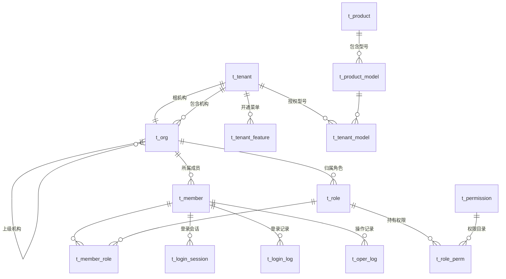

---

## 5. 接口设计

### 5.1 接口设计规范

| 项 | 约定 |
|---|---|
| 风格 | REST 风格 JSON 接口，路径前缀 `/api` |
| 路径命名 | 资源用复数小写中划线，如 `/api/members`、`/api/device-groups` |
| 方法语义 | `GET` 查询、`POST` 新增与动作、`PUT` 全量更新、`DELETE` 删除 |
| 动作类接口 | 非 CRUD 动作用子资源路径，如 `POST /api/members/{id}/password/reset` |
| 认证 | 除登录、找回密码外均需 `Authorization: Bearer {token}` |
| 鉴权 | 每个接口在代码中声明 `@RequiresPerm`，无声明的业务接口不允许合入 |
| 时间格式 | 请求与响应统一 `yyyy-MM-dd'T'HH:mm:ss.SSS'Z'`（UTC） |
| 语言 | 请求带 `Accept-Language`（或 `lang` 参数），取 `zh-CN` 或 `en`，缺省 `zh-CN`；响应中的 `message` 与各类 `xxxLabel` 按该语言返回，详见 7.13 |
| 主键格式 | 雪花算法主键超出 JavaScript 安全整数范围，响应中统一序列化为字符串；请求侧字符串与数字均可接受 |
| 分页 | 请求 `pageNum` 从 1 开始、`pageSize` 默认 20 最大 200 |
| 幂等 | 写操作需要幂等时由客户端传 `Idempotency-Key` 请求头 |
| 文件 | 上传用 `multipart/form-data`，下载与导出返回对象存储的临时链接 |

### 5.2 公共请求与响应约定

**统一响应体**

```json
{
  "code": "0",
  "message": "success",
  "data": {},
  "traceId": "3f2b8c7d9a1e4f60b5c8d2a7e1f40936"
}
```

`code` 为 `"0"` 表示成功，其余为业务错误码（9.2）。HTTP 状态码同时反映结果：200 成功、400 参数或业务校验失败、401 未认证、403 无权限、404 资源不存在、409 状态冲突、503 依赖不可用。

**分页响应体**

```json
{
  "code": "0",
  "data": { "total": 128, "pageNum": 1, "pageSize": 20, "list": [] }
}
```

**批量部分成功响应体**

```json
{
  "code": "0",
  "data": {
    "batchNo": "SO20260918000012",
    "total": 100, "successCount": 97, "failCount": 3,
    "failures": [{ "key": "SN0001", "reason": "设备存在执行中任务" }]
  }
}
```

批量接口一律返回 HTTP 200 并在 `data` 中区分成败，不因部分失败返回错误码，详见 7.10。

### 5.3 认证接口

| Method | Path | 说明 | 权限 |
|---|---|---|---|
| POST | `/api/auth/login` | 账号密码登录 | 无需认证 |
| POST | `/api/auth/logout` | 退出登录 | 已登录 |
| GET | `/api/auth/profile` | 当前登录人信息与有效权限 | 已登录 |
| PUT | `/api/auth/profile` | 维护昵称、邮箱、联系电话 | 已登录 |
| POST | `/api/auth/password` | 修改本人密码 | 已登录 |
| POST | `/api/auth/password/forgot` | 发起找回密码 | 无需认证 |
| POST | `/api/auth/password/reset` | 凭邮件令牌重置密码 | 无需认证 |
| POST | `/api/auth/email/verify` | 发起或确认邮箱验证 | 已登录 |

#### 5.3.1 `POST /api/auth/login`

请求：

| 参数 | 类型 | 必填 | 说明 |
|---|---|---|---|
| `account` | String | 是 | 登录账号 |
| `password` | String | 是 | 密码明文，仅经 HTTPS 传输 |
| `entry` | String | 是 | 会话入口，取值见 6.2.11 |

响应 `data`：

| 字段 | 类型 | 说明 |
|---|---|---|
| `token` | String | 访问令牌 |
| `expiresIn` | Integer | 滑动有效期秒数 |
| `mustChangePassword` | Boolean | 为真时除改密和退出外的接口一律拒绝 |
| `member` | Object | 成员编号、账号、昵称、所属客户与机构 |
| `menus` | Array | 有权访问的菜单键列表 |
| `permissions` | Object | `权限码 → 数据范围` 映射 |

错误：`AUTH_001` 账号或密码错误、`AUTH_002` 账号已停用、`AUTH_003` 账号已锁定。

#### 5.3.2 `GET /api/auth/profile`

返回内容与登录响应的 `member`、`menus`、`permissions` 一致，供前端刷新页面后重建权限状态，不重新签发令牌。

### 5.4 权限与角色接口

| Method | Path | 说明 | 权限 |
|---|---|---|---|
| GET | `/api/permissions/catalog` | 权限目录，按菜单分组返回可配置项 | `roles:view` |
| GET | `/api/permissions/grantable` | 操作者对指定机构可授予的权限码 | `roles:create` 或 `roles:edit` |
| GET | `/api/roles` | 角色分页查询 | `roles:view` |
| GET | `/api/roles/{id}` | 角色详情含权限码 | `roles:view` |
| POST | `/api/roles` | 新增角色 | `roles:create` |
| PUT | `/api/roles/{id}` | 编辑角色与权限 | `roles:edit` |
| POST | `/api/roles/{id}/copy` | 复制角色 | `roles:copy` |
| POST | `/api/roles/{id}/status` | 启用或停用 | `roles:toggle` |
| DELETE | `/api/roles/{id}` | 删除角色 | `roles:delete` |
| GET | `/api/roles/options` | 成员分配角色时的候选角色 | `members:assign` |
| GET | `/api/roles/export` | 导出角色 | `roles:export` |

#### 5.4.1 `GET /api/permissions/catalog`

请求参数 `orgId`（目标机构，用于定位租户及其已开通菜单）。响应按菜单分组返回，每个菜单包含菜单键、名称、分组、可配置操作列表，以及每个操作的 `grantable` 标记——不可授予项返回但置灰，不从响应中剔除，便于页面展示已有的只读权限。

目标租户非平台时，`platform_only = 1` 的权限码不出现在响应中。

#### 5.4.2 `PUT /api/roles/{id}`

请求体含 `name`、`description`、`dataScope`、`permCodes`、`version`。服务端校验：权限码均在可授予集合内、查看依赖已满足、名称未重复、`version` 未被并发修改。校验失败整体拒绝，返回越权或缺失的权限码清单。

### 5.5 客户与产品型号接口

| Method | Path | 说明 | 权限 |
|---|---|---|---|
| GET | `/api/tenants` | 客户分页查询 | `customers:view` |
| GET | `/api/tenants/{id}` | 客户详情 | `customers:view` |
| POST | `/api/tenants` | 新增客户及其根机构与管理员 | `customers:create` |
| PUT | `/api/tenants/{id}` | 编辑客户 | `customers:edit` |
| POST | `/api/tenants/{id}/status` | 启用或停用客户 | `customers:toggle` |
| DELETE | `/api/tenants/{id}` | 删除客户 | `customers:delete` |
| GET | `/api/tenants/feature-options` | 客户功能授权可选菜单，新增客户时渲染勾选项 | `customers:authorize` |
| GET | `/api/tenants/{id}/features` | 查询客户功能授权 | `customers:authorize` |
| PUT | `/api/tenants/{id}/features` | 保存客户功能授权 | `customers:authorize` |
| GET | `/api/tenants/export` | 导出客户 | `customers:export` |
| GET | `/api/products` | 产品分页查询 | `products:view` |
| GET | `/api/products/{id}` | 产品详情含型号 | `products:view` |
| POST | `/api/products` | 新增产品与型号 | `products:create` |
| PUT | `/api/products/{id}` | 编辑产品与型号 | `products:edit` |
| DELETE | `/api/products/{id}` | 删除产品 | `products:delete` |
| GET | `/api/products/export` | 导出产品 | `products:export` |
| GET | `/api/product-models/options` | 型号下拉，按客户授权过滤 | 任一需要型号的菜单查看权限 |

#### 5.5.1 `PUT /api/tenants/{id}/features`

请求体为 `menuKeys` 数组。服务端校验每个菜单键存在，且该菜单至少有一个 `platform_only = 0` 的权限码；`home` 强制包含。保存成功后自增 `feature_version`，该客户全部成员的下一次请求按新范围校验（7.2）。响应返回本次新增与关闭的菜单清单，供页面提示影响范围。

该接口只用于客户租户；平台租户恒为全开，不提供修改入口。

### 5.6 机构接口

| Method | Path | 说明 | 权限 |
|---|---|---|---|
| GET | `/api/orgs/tree` | 权限范围内的机构树，含各节点及下级机构数 | `orgs:view` |
| GET | `/api/orgs` | 机构分页查询，支持按节点筛选该机构及下级 | `orgs:view` |
| GET | `/api/orgs/{id}` | 机构详情 | `orgs:view` |
| POST | `/api/orgs` | 新增机构及其管理员 | `orgs:create` |
| PUT | `/api/orgs/{id}` | 编辑机构 | `orgs:edit` |
| POST | `/api/orgs/{id}/status` | 启用或停用 | `orgs:toggle` |
| DELETE | `/api/orgs/{id}` | 删除机构 | `orgs:delete` |
| GET | `/api/orgs/selector` | 可选上级机构树，只返回可管理且已启用的节点 | `orgs:create` 或 `orgs:edit` |
| GET | `/api/orgs/export` | 导出机构 | `orgs:export` |

`GET /api/orgs` 的 `orgId` 参数表示按该机构及下级筛选，服务端按 `org_path` 前缀匹配，不做递归查询。

### 5.7 成员接口

| Method | Path | 说明 | 权限 |
|---|---|---|---|
| GET | `/api/members` | 成员分页查询 | `members:view` |
| GET | `/api/members/{id}` | 成员详情含角色 | `members:view` |
| POST | `/api/members` | 新增成员，返回系统生成的初始密码 | `members:create` |
| PUT | `/api/members/{id}` | 编辑成员 | `members:edit` |
| POST | `/api/members/{id}/status` | 启用或停用 | `members:toggle` |
| DELETE | `/api/members/{id}` | 删除成员 | `members:delete` |
| POST | `/api/members/{id}/password/reset` | 重置密码，返回新的初始密码 | `members:reset` |
| PUT | `/api/members/{id}/roles` | 分配角色 | `members:assign` |
| GET | `/api/members/export` | 导出成员 | `members:export` |

初始密码只在创建与重置的响应中返回一次，不落库明文、不写日志、不提供二次查询接口。

### 5.8 日志与会话接口

| Method | Path | 说明 | 权限 |
|---|---|---|---|
| GET | `/api/oper-logs` | 操作日志分页查询 | `logs:view` |
| GET | `/api/oper-logs/{id}` | 操作日志详情含变更摘要 | `logs:view` |
| GET | `/api/oper-logs/export` | 导出操作日志 | `logs:export` |
| GET | `/api/login-logs` | 登录日志分页查询 | `logins:view` |
| GET | `/api/login-logs/export` | 导出登录日志 | `logins:export` |
| GET | `/api/sessions` | 在线会话分页查询 | `sessions:view` |
| POST | `/api/sessions/{id}/force-logout` | 强制下线单条会话 | `sessions:force` |
| GET | `/api/sessions/export` | 导出在线会话 | `sessions:view` |

`POST /api/sessions/{id}/force-logout` 请求体必填 `reason`；当前会话不允许作为目标，返回 `SESSION_003`。

### 5.9 设备 TCP 协议接口

设备侧接口的逐命令字段表已在 `docs/protocol/` 定义，本节只规定服务端实现约定，不重复字段清单。

| 文档 | 覆盖命令 |
|---|---|
| `docs/protocol/OTA升级接口规范.md` | 10 更新请求、11 下载请求、12 安装完成通知、13 终端状态设置 |
| `docs/protocol/远程激活与密钥下载接口规范.md` | A0 激活握手、A1 激活、A2 认证、A3 密钥下载 |
| `docs/protocol/README.md` | 报文骨架、全局响应码表、时序与时限、已确认结论 |

#### 5.9.1 报文骨架与编解码

报文结构为 `长度 + 命令码 + 报文信息 + LRC`，LRC 校验范围为「命令码 + 报文信息」，按字节异或计算。

编解码实现约定：

1. **按字段位置对齐，不按字段名对齐**。原文中下载请求、激活报文的命令码字段写作 `responseCode`，激活响应出现两行 `orderCode`（分别是命令码与响应码），属原文笔误。
2. 字段填充按原文规定：OTA 侧 ASCII 定长串（数字左补 `0`、文本右补空格），激活与 RKI 侧 HEX（补 `0x00`）。
3. 长度字段的编码与口径见 9.3 待确认项 A，实现时集中在一个常量类，确认后单点修改。
4. 响应码只取自 `docs/protocol/README.md` 的全局响应码表，不在单个命令的处理器内自定义；平台内部错误使用独立错误码并映射为 `05 系统忙`。
5. 解码失败（长度不符、LRC 不匹配）返回 `08`，字段结构不符返回 `15`，均走错误响应报文结构 `长度 + 命令码 + 响应码 + LRC`。

#### 5.9.2 命令路由与会话

| 命令 | 处理模块 | 会话要求 |
|---|---|---|
| 10、11、12、13 | `tms-ota` | 无跨请求会话，可短连接 |
| A0 → A1 | `tms-activation` | 同一 TCP 连接内完成，A0 响应后 5 分钟内必须收到 A1 |
| A2 → A3 | `tms-rki` | 同一 TCP 连接内完成，A2 完成后 10 分钟内必须完成 A3 循环 |

握手与认证上下文以连接属性为主、Redis 为备（键含 SN 与会话标识，TTL 等于协议时限）。连接关闭或超时即清除上下文，对应会话按超时失败处理。

#### 5.9.3 通用处理顺序

每条设备请求按固定顺序处理，任一步失败即返回对应响应码并结束：

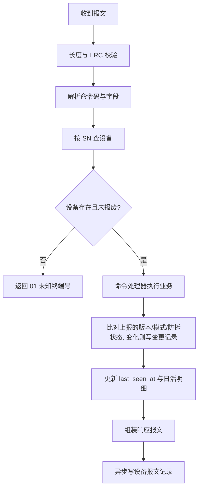

有效通信仅指身份校验通过的任务查询、状态上报与执行结果上报；管理后台查询、鉴权失败和仅建立 TCP 连接不更新 `last_seen_at`。以服务端接收时间为准，不使用设备自报时钟。

---

## 6. 状态与枚举设计

### 6.1 状态与枚举约定

| 项 | 约定 |
|---|---|
| 存储形式 | 数据库存英文编码字符串，不存数字 |
| 定义位置 | 本章是唯一来源，数据库、接口与功能章节只引用不重复定义 |
| 代码位置 | 各模块 `enums` 包；跨模块共用的枚举放 `tms-common` |
| 前端取值 | 筛选项按枚举完整取值渲染，不按当前页数据推导 |
| 扩展 | 新增取值在本章登记后才允许写入数据库 |

### 6.2 基座状态与枚举

#### 6.2.1 账户边界与菜单可见性

账户边界不是代码中的菜单名单，而是权限目录 `t_permission.platform_only` 字段（4.3.8）承载的目录数据，粒度为**权限码**而非菜单。新增菜单时只改权限目录初始化数据，不改代码。

| 边界 | 编码 | 说明 |
|---|---|---|
| 平台 | `PLATFORM` | `tenant_id = 0` 的机构与成员 |
| 客户 | `TENANT` | `tenant_id > 0` 的机构与成员 |

**`platform_only = 1` 的权限码**

| 菜单 | 范围 | 原因 |
|---|---|---|
| `customers` | 全部操作 | 客户去管理客户在数据范围上不成立 |
| `products` | 全部操作 | 型号是平台主数据，客户只能使用不能维护 |
| `mode` | 全部操作 | 功能清单明确模式设置仅平台可操作 |
| `cas` | 全部操作 | 平台只有一套 CA，不属于任何客户 |
| `servercerts` | 全部操作 | 同上，平台自身服务证书 |
| `devices` | 仅 `stockin`、`stockout`、`return` | 平台库存出入库属于平台边界；设备菜单本身客户可用 |

其余权限码 `platform_only = 0`。

**数量口径**

| 项 | 数量 |
|---|---|
| 平台可用菜单 | 25（全部） |
| 客户功能授权可选菜单 | 20（`home` 强制包含且不可取消） |
| 全部权限码 | 120 |

平台与客户共用同一套租户功能授权模型：平台租户（`tenant_id = 0`）的功能授权初始化为全部 25 个菜单（4.3.2），客户租户在创建时分配。有效权限计算对两者是同一条路径，运行时没有按账户类型分支的逻辑。

**RKI 三菜单**（`keys`、`rki`、`rki-records`）不是平台专属，客户可开通；对平台默认开通。三者进入内置平台管理员角色，但不进入客户侧内置角色，详见 7.3。

**与原型的已知差异**：`prototype/TMS-原型.html` 的 `PLATFORM_ONLY` 常量仍含 `grants`、`codes`，且对平台排除 RKI 三菜单，与本节不一致。原型的账户判断分散在多处条件渲染中，同步改造是独立工作，本文档为准。

#### 6.2.2 权限目录

权限码格式 `菜单键:操作`，全量 25 个菜单、120 个权限码如下。

| 分组 | 菜单键 | 菜单名称 | 可配置操作 | 平台专属 |
|---|---|---|---|---|
| — | `home` | 工作台 | view | — |
| 设备管理 | `devices` | 设备列表 | view、stockin、stockout、transfer、return、scrap、export | 仅 stockin、stockout、return |
| 设备管理 | `groups` | 设备分组 | view、create、edit、delete、import、export | — |
| 设备管理 | `operations` | 流转记录 | view、revoke、export | — |
| 设备管理 | `mode` | 设备模式任务 | view、create、edit、publish、stop、copy、delete、export | 全部操作 |
| 远程维护 | `packages` | 升级包管理 | view、create、edit、upload、toggle、delete、export | — |
| 远程维护 | `ota` | OTA 任务 | view、create、edit、publish、stop、copy、delete、export | — |
| 远程维护 | `ota-records` | OTA 执行记录 | view、export | — |
| 远程维护 | `keys` | 密钥管理 | view、import、edit、toggle、export | — |
| 远程维护 | `rki` | RKI 任务 | view、create、edit、publish、stop、copy、delete、export | — |
| 远程维护 | `rki-records` | RKI 执行记录 | view、export | — |
| 激活与证书 | `grants` | 激活授权 | view、create、edit、toggle、export | — |
| 激活与证书 | `codes` | 授权码记录 | view、create、revoke、export | — |
| 激活与证书 | `activations` | 设备激活记录 | view、export | — |
| 激活与证书 | `cas` | CA 管理 | view、generate、import、toggle、provision、export | 全部操作 |
| 激活与证书 | `certs` | 设备证书 | view、export | — |
| 激活与证书 | `servercerts` | 平台服务证书 | view、sign、import、toggle、export | 全部操作 |
| 系统管理 | `customers` | 客户管理 | view、create、edit、toggle、delete、authorize、export | 全部操作 |
| 系统管理 | `orgs` | 机构管理 | view、create、edit、toggle、delete、export | — |
| 系统管理 | `members` | 成员管理 | view、create、edit、toggle、delete、reset、assign、export | — |
| 系统管理 | `roles` | 角色管理 | view、create、edit、toggle、delete、copy、export | — |
| 系统管理 | `products` | 产品与型号 | view、create、edit、delete、export | 全部操作 |
| 系统管理 | `logs` | 操作日志 | view、export | — |
| 系统管理 | `logins` | 登录日志 | view、export | — |
| 系统管理 | `sessions` | 在线会话 | view、force | — |

操作编码含义：

| 操作 | 名称 | 操作 | 名称 |
|---|---|---|---|
| `view` | 查看 | `create` | 新增 |
| `edit` | 编辑 | `delete` | 删除 |
| `export` | 导出 | `import` | 导入 |
| `toggle` | 启用／停用 | `copy` | 复制 |
| `publish` | 发布 | `stop` | 停止 |
| `upload` | 上传版本 | `revoke` | 撤销 |
| `reset` | 重置密码 | `assign` | 分配角色 |
| `authorize` | 功能授权 | `force` | 强制下线 |
| `generate` | 自签生成 | `provision` | 标记产线预置 |
| `sign` | 平台签发 | `stockin` | 入库 |
| `stockout` | 出库 | `transfer` | 转移 |
| `return` | 退货回收 | `scrap` | 报废 |

#### 6.2.3 机构类型 `OrgType`

| 编码 | 名称 | 说明 |
|---|---|---|
| `PLATFORM` | 平台 | 平台根机构，全系统唯一 |
| `TENANT_ROOT` | 客户根机构 | 每个客户一个，与 `t_tenant` 一一对应 |
| `BRANCH` | 下级机构 | 客户内部的多级机构 |

#### 6.2.4 会话状态 `SessionStatus`

| 编码 | 名称 |
|---|---|
| `ACTIVE` | 有效 |
| `INVALID` | 已失效 |

#### 6.2.5 会话失效原因 `SessionInvalidReason`

| 编码 | 名称 | 触发方 |
|---|---|---|
| `LOGOUT` | 主动退出 | 本人 |
| `FORCE_LOGOUT` | 强制下线 | 管理员 |
| `TIMEOUT` | 超时 | 系统 |
| `ACCOUNT_DISABLED` | 账号停用 | 管理员 |
| `ORG_DISABLED` | 组织停用 | 管理员 |
| `PASSWORD_RESET` | 管理员重置密码 | 管理员 |
| `PASSWORD_CHANGED` | 本人修改密码 | 本人 |
| `MEMBER_DELETED` | 成员删除 | 管理员 |

#### 6.2.6 通用启停状态 `EnableStatus`

| 编码 | 名称 |
|---|---|
| `ENABLED` | 启用 |
| `DISABLED` | 停用 |

适用于客户、机构、成员、角色、升级版本、激活授权、密钥材料、CA、平台服务证书。

#### 6.2.7 业务模块编码 `LogModule`

稳定编码，菜单改名不改变历史归类。

| 编码 | 名称 | 编码 | 名称 |
|---|---|---|---|
| `DEVICE` | 设备管理 | `DEVICE_GROUP` | 设备分组 |
| `DEVICE_FLOW` | 设备流转 | `MODE_TASK` | 设备模式任务 |
| `PACKAGE` | 升级包管理 | `OTA_TASK` | OTA 任务 |
| `KEY` | 密钥管理 | `RKI_TASK` | RKI 任务 |
| `ACTIVATION_GRANT` | 激活授权 | `AUTH_CODE` | 授权码 |
| `ACTIVATION` | 设备激活 | `CA` | CA 管理 |
| `DEVICE_CERT` | 设备证书 | `SERVER_CERT` | 平台服务证书 |
| `TENANT` | 客户管理 | `ORG` | 机构管理 |
| `MEMBER` | 成员管理 | `ROLE` | 角色管理 |
| `PRODUCT` | 产品与型号 | `SESSION` | 在线会话 |
| `AUTH` | 认证与账号安全 | — | — |

#### 6.2.8 操作类型 `OperAction`

| 编码 | 名称 | 编码 | 名称 |
|---|---|---|---|
| `CREATE` | 新增 | `UPDATE` | 编辑 |
| `DELETE` | 删除 | `IMPORT` | 导入 |
| `EXPORT` | 导出 | `PUBLISH` | 发布 |
| `STOP` | 停止 | `TOGGLE` | 启停 |
| `AUTHORIZE` | 功能授权 | `ASSIGN_ROLE` | 角色分配 |
| `RESET_PASSWORD` | 重置密码 | `FORCE_LOGOUT` | 强制下线 |
| `REVOKE` | 撤销 | `GENERATE` | 生成 |
| `SIGN` | 签发 | `PROVISION` | 标记产线预置 |
| `VIEW_SENSITIVE` | 敏感信息查看 | — | — |

#### 6.2.9 产品类别 `ProductCategory`

| 编码 | 名称 |
|---|---|
| `TRADITIONAL_POS` | 传统 POS |
| `DESKTOP_POS` | 台式 POS |

不提供“其他”类别；新增类别在实际产品需求明确后登记。

#### 6.2.10 数据范围 `DataScope`

| 编码 | 名称 | 过滤条件 |
|---|---|---|
| `SELF_ORG` | 仅成员所属机构 | `org_id = 成员机构 ID` |
| `ORG_AND_SUB` | 成员所属机构及下级机构 | `org_path LIKE '成员机构路径%'` |

两个取值均以成员所在机构为基准。范围大小 `ORG_AND_SUB > SELF_ORG`，多角色合并时取较大者，详见 7.1。

#### 6.2.11 会话入口 `SessionEntry`

| 编码 | 名称 | 说明 |
|---|---|---|
| `CONSOLE` | 管理后台 | 浏览器访问 |
| `TOOL` | 激活工具 | PC 激活工具登录 |

#### 6.2.12 登录结果 `LoginResult`

| 编码 | 名称 |
|---|---|
| `SUCCESS` | 成功 |
| `FAIL` | 失败 |

#### 6.2.13 操作结果 `OperResult`

| 编码 | 名称 | 说明 |
|---|---|---|
| `SUCCESS` | 成功 | 全部处理成功 |
| `PARTIAL` | 部分成功 | 批量业务存在失败项 |
| `FAIL` | 失败 | 整体失败 |

### 6.3 业务状态与枚举

业务模块详细设计在下一轮展开，但以下取值被多个模块共用，本轮先行定义。

#### 6.3.1 设备库存状态 `StockStatus`

| 编码 | 名称 | 说明 |
|---|---|---|
| `IN_STOCK` | 在库 | 平台库存 |
| `SHIPPED` | 已出库 | 已分配给客户 |
| `SCRAPPED` | 报废 | 保留原归属，不计入任何统计 |

#### 6.3.2 设备激活状态 `ActivationStatus`

| 编码 | 名称 |
|---|---|
| `INACTIVE` | 未激活 |
| `ACTIVE` | 已激活 |

按设备当前状态计数，每台只计一次；出库时重置为未激活。

#### 6.3.3 设备模式 `DeviceMode`

| 编码 | 名称 | 协议终端状态 |
|---|---|---|
| `FACTORY` | 工厂 | factory |
| `DEBUG` | 调试 | debug |
| `PRODUCT` | 产品 | product |
| `LOCK` | 锁定 | Lock |

设备入库时为空，详情显示“—”。模式变更规则：任何模式都不能变更为工厂；工厂只能变更为调试或产品；调试、产品、锁定三者可互相变更。模式任务的目标模式只提供调试、产品、锁定。四字节协议编码见 9.3 待确认项 F。

#### 6.3.4 防拆状态 `TamperStatus`

| 编码 | 名称 |
|---|---|
| `NORMAL` | 未触发 |
| `TRIGGERED` | 已触发 |

由设备上报驱动，平台不按任务或操作推断；防拆激活完成后由设备上报恢复为未触发。

#### 6.3.5 流转操作类型 `StockOperType`

| 编码 | 名称 | 编码 | 名称 |
|---|---|---|---|
| `RANGE_IN` | 号段入库 | `BATCH_IN` | 批量入库 |
| `SHIP_OUT` | 设备出库 | `TRANSFER` | 设备转移 |
| `RETURN` | 退货回收 | `SCRAP` | 设备报废 |
| `TRANSFER_REVOKE` | 撤销转移 | — | — |

#### 6.3.6 任务类型 `TaskType`

| 编码 | 名称 | 有效期 |
|---|---|---|
| `OTA` | OTA 升级任务 | 支持永久有效或指定起止时间 |
| `RKI` | RKI 密钥下发任务 | 不设置有效期 |
| `MODE` | 设备模式任务 | 不设置有效期 |

#### 6.3.7 任务状态 `TaskStatus`

三类任务统一使用同一套状态。

| 编码 | 名称 | 说明 |
|---|---|---|
| `DRAFT` | 草稿 | 可编辑、可删除 |
| `RUNNING` | 执行中 | 发布成功后立即进入，表示任务已生效并等待或正在由设备执行 |
| `FINISHED` | 已完成 | 全部执行项终态 |
| `STOPPED` | 已停止 | 人工停止，需填写停止原因 |

“发布”是操作，不单列“已发布”状态。

#### 6.3.8 任务执行结果 `AssignmentResult`

| 编码 | 名称 | 说明 |
|---|---|---|
| `PENDING` | 待执行 | 已下发，设备尚未领取 |
| `EXECUTING` | 执行中 | 设备已领取，未回传结果 |
| `SUCCESS` | 成功 | 设备回传成功 |
| `FAILED` | 失败 | 设备回传失败，记录失败原因 |
| `CANCELED` | 已取消 | 任务停止时未开始的执行项 |

执行失败按「任务 + 设备」一台次计数，不累加重试次数。

#### 6.3.9 授权码发放渠道 `AuthCodeChannel`

| 编码 | 名称 | 说明 |
|---|---|---|
| `TOOL` | 后台取码 | 申请人在管理后台取码后交激活工具使用，建议默认值，私有化部署无邮件服务时的唯一可用渠道 |
| `EMAIL` | 邮箱发送 | 平台将授权码发送到申请账户已验证的邮箱 |

配置粒度到客户（`t_tenant.auth_code_channel`），平台可设默认值。启用 `EMAIL` 时要求账户邮箱已验证，未验证则拒绝申请并提示，不静默回落到 `TOOL`。两种渠道共用同一套申请校验、绑定、额度、过期与撤销规则。

#### 6.3.10 授权码状态 `AuthCodeStatus`

| 编码 | 名称 | 说明 |
|---|---|---|
| `PENDING` | 待使用 | 已发放，未建立激活会话 |
| `USED` | 已使用 | 激活会话已建立，不代表激活成功 |
| `EXPIRED` | 已过期 | 超过过期时间未使用 |
| `REVOKED` | 已撤销 | 人工撤销或被新申请自动撤销 |

#### 6.3.11 激活类型 `ActivationType`

| 编码 | 名称 | 场景 |
|---|---|---|
| `FACTORY` | 工厂激活 | 整机组装阶段抽检，测试完成后还原再出货 |
| `DELIVERY` | 出厂激活 | 设备出库到货后客户首次启用 |
| `TAMPER` | 防拆激活 | 触发防拆自毁后恢复 |

激活趋势统计只含出厂激活与防拆激活，不含工厂激活。

#### 6.3.12 CA 用途 `CaPurpose`

| 编码 | 名称 | 协议密钥名 |
|---|---|---|
| `ACTIVATION` | 激活 CA | `CA_PK` / `CA_SK` |
| `RKI` | RKI CA | `RKI_CA_PK` / `RKI_CA_SK` |
| `TLS` | TLS CA | 签发终端 TLS 证书与 KDH 服务端证书 |

每个用途同时只允许一条启用中的 CA。密码学参数由协议固定：RSA-2048、SHA256withRSA、PKCS#1 v1.5，页面只读展示。

#### 6.3.13 证书用途 `CertPurpose`

| 编码 | 名称 | 协议密钥名 | 签发 CA |
|---|---|---|---|
| `DEVICE_IDENTITY` | 设备身份证书 | `Term_PK` / `Term_SK` | 激活 CA |
| `DEVICE_RKI` | RKI 证书 | `Term_RKI_PK` / `Term_RKI_SK` | RKI CA |
| `DEVICE_TLS` | TLS 证书 | `Term_TLS_PK` / `Term_TLS_SK` | TLS CA |
| `SERVER_KDH` | 设备接入服务证书 | `CERTkdh` | 平台 TLS CA |
| `SERVER_CONSOLE` | 管理后台 HTTPS | — | 公开受信任 CA，只能导入 |
| `SERVER_INTERNAL` | 内部服务 TLS | — | 平台 TLS CA |

三套设备密钥对在 A1 激活时一次性下发，不分批、不在 RKI 阶段补发。

#### 6.3.14 证书状态 `CertStatus`

| 编码 | 名称 | 说明 |
|---|---|---|
| `PENDING_DELIVER` | 待下发 | 已签发，尚未下发设备 |
| `PENDING_CONFIRM` | 待确认 | 已下发，设备未确认写入 |
| `VALID` | 有效 | 设备已确认 |
| `EXPIRED` | 已过期 | 超过有效期 |
| `REVOKED` | 已吊销 | 出库重置或人工吊销 |
| `REPLACED` | 已替换 | 被新证书取代 |

证书统计只计当前使用记录，排除吊销、停用及已替换的历史证书。

#### 6.3.15 升级类型与可用范围

| 升级类型 `PackageType` | 名称 | 协议下载类型 |
|---|---|---|
| `APP` | 应用 | 0 |
| `PARAM` | 参数 | 1 |
| `KERNEL` | Kernel | 2 |

| 可用范围 `PackageScope` | 名称 | 说明 |
|---|---|---|
| `COMMON` | 通用内容 | 对所有获该型号授权的客户可用 |
| `TENANT` | 指定客户 | 只对该客户及其下级机构可见可用 |

可用范围创建后不可修改；客户自建的 APP 与参数内容不提供范围选项，始终客户隔离。

#### 6.3.16 密钥类型与文件解密算法

| 密钥类型 `KeyType` | 名称 | 密钥体系 |
|---|---|---|
| `TMK` | TMK | MK/SK |
| `IPEK` | IPEK | DUKPT |
| `FIXED_KEY` | Fixed Key | Fixed Key |

不含 PIN／MAC／数据等工作密钥；不接收 BDK、不做派生。

| 文件解密算法 `FileDecAlgorithm` | 密钥长度 | IV |
|---|---|---|
| `TDES_ECB` | 16／24 字节 | 无 |
| `TDES_CBC` | 16／24 字节 | 文件每行提供 8 字节 |
| `AES_ECB` | 16／24／32 字节 | 无 |
| `AES_CBC` | 16／24／32 字节 | 文件每行提供 16 字节 |
| `AES_KW` | 16／24／32 字节 | 无（RFC 3394） |

ECB／CBC 统一约定 NoPadding，不设置整文件公共 IV。KCV 约定：TDES 对 8 字节零块加密取前 3 字节，AES 对 16 字节零块计算 CMAC 取前 3 字节，均显示 6 位十六进制。

#### 6.3.17 设备协议命令码与响应码

命令码与响应码是两套独立编号，数值可重复，解码时按报文位置区分。全量取值以 `docs/protocol/README.md` 的「命令码」与「全局响应码表」为唯一来源，本文档不重复维护。

---

## 7. 异常与关键技术处理

### 7.1 数据权限控制

**有效权限的数据结构是 `Map<权限码, 数据范围>`，不是「权限码集合 + 全局数据范围」两个独立字段。** 后者会让成员借 A 角色的宽数据范围执行 B 角色授予的操作，属于功能清单明令禁止的越权拼接。

计算过程：

1. 取成员所有启用状态的角色。
2. 每个角色产生若干 `(权限码, 该角色的数据范围)` 二元组。
3. 按所属租户的 `t_tenant_feature` 过滤未开通菜单的权限码。平台租户开通全部菜单，因此该步对平台不产生剔除，但走的是同一段代码。
4. 按权限目录 `platform_only` 兜底过滤：租户非平台时剔除 `platform_only = 1` 的权限码。权限目录常驻内存缓存（25 菜单 120 权限码），该步不产生额外查询。
5. 按权限码合并，同一权限码存在多个数据范围时取较大者（`ORG_AND_SUB > SELF_ORG`）。

第 4 步是防止历史误配置长期生效的兜底；正常路径上 `platform_only = 1` 的权限码在角色保存时就已被可授予集合挡住。两处都读权限目录数据，不含硬编码菜单名单。

执行期校验：

| 环节 | 实现 |
|---|---|
| 功能权限 | 方法上的 `@RequiresPerm("devices:stockout")`，AOP 在会话权限表中查找该权限码，不存在即返回 403 |
| 数据范围 | 同一切面取出该权限码对应的数据范围写入请求上下文 |
| SQL 过滤 | MyBatis 拦截器读取上下文，对标注 `@DataScope` 的 Mapper 方法追加 `tenant_id = ?`（平台账户跳过该条件），并按范围追加 `org_id = ?` 或 `org_path LIKE ?`；租户条件与机构范围条件由同一个拦截器一次性追加，列名可在注解上按表指定（如角色表的 `owner_org_id` / `owner_org_path`） |
| 单条校验 | 按 ID 操作单条记录时，除范围过滤外再校验该记录的 `org_path` 是否在成员范围内，防止越权改单条 |

前端隐藏菜单不构成权限控制；每个请求都必须在服务端完成上述校验。

### 7.2 会话失效与权限变更传播

权限相关数据分三个层级，各自维护版本号：

| 层级 | 版本字段 | 变更触发 |
|---|---|---|
| 客户功能授权 | `t_tenant.feature_version` | 保存功能授权 |
| 角色权限 | `t_role.perm_version` | 角色权限、数据范围或状态变更 |
| 成员角色 | `t_member.perm_version` | 成员角色分配变更 |

会话中保存三个版本号的组合值。每次请求鉴权时比对当前值，任一不一致即重新加载有效权限并刷新会话，无需等待会话过期，也无需广播失效消息。

会话本身的失效是删除 Redis 键加更新会话表状态。批量失效场景（账号停用、组织停用、成员删除）按 `member_id` 或 `org_path` 查出有效会话逐条删除。

### 7.3 租户隔离

1. 所有业务数据表带 `tenant_id`，平台数据为 0。
2. MyBatis 租户拦截器按会话上下文自动追加 `tenant_id` 条件；平台账户跳过该条件但仍受数据范围约束。
3. 平台可按业务职责跨客户查看设备与任务。`keys`、`rki`、`rki-records` 三个菜单对平台默认开通并包含在内置平台管理员角色中，平台管理员对客户支付密钥的操作照常进操作日志；需要收敛平台人员范围时，用剔除这三个菜单的自定义角色。客户侧内置角色不含这三个菜单，客户人员必须由自定义角色显式授予。菜单开通是租户级、权限授予是角色级，两者分开控制。
4. 明确需要跨租户的查询（如平台工作台的客户设备分布）走白名单标注的 Mapper 方法，跳过租户拦截器，并在代码审查中逐个确认。

### 7.4 统一异常与错误码

| 异常类型 | 处理 |
|---|---|
| `BizException` | 业务校验失败，返回 HTTP 400 与业务错误码 |
| `AuthException` | 未认证，返回 401 |
| `PermissionException` | 无权限或超出数据范围，返回 403 |
| `NotFoundException` | 资源不存在，返回 404 |
| `ConflictException` | 状态冲突或乐观锁失败，返回 409 |
| 参数校验失败 | Bean Validation 异常，返回 400 与首个字段错误 |
| 路径未匹配到处理器 | 返回 404 与 `COMMON_003`，按客户端错误只记一条 WARN，不打堆栈 |
| 未捕获异常 | 返回 500，响应只含 `traceId`，堆栈只进服务端日志 |

全局异常处理器统一包装为 5.2 的响应体，任何情况下不把堆栈、SQL、内部路径返回给客户端。

### 7.5 操作日志与关联编号

每个请求在入口生成 32 位十六进制 `trace_id`，透传至三条记录链路：

| 链路 | 表 | 写入时机 |
|---|---|---|
| 接口访问日志 | `t_api_access_log` | 响应完成后 |
| 业务操作日志 | `t_oper_log` | 业务方法成功或失败后 |
| 设备报文记录 | `t_device_message` | 设备接入完成一次请求与响应后 |

设备侧请求同样生成 `trace_id`，因此设备报文与后台人员操作可以串联到同一次业务（例如某台设备的升级来自哪个任务、由谁发布）。

操作日志按 `@OperationLog(module = ..., action = ...)` 注解声明；变更摘要由各模块提供字段白名单，未在白名单内的字段不进入摘要。

### 7.6 敏感数据保护与加密存储

**禁止落库、禁止写日志、禁止出现在接口响应与导出文件中的内容：**

| 内容 | 处理 |
|---|---|
| 登录密码 | 只存 BCrypt 哈希 |
| 会话令牌 | 只存 SHA-256 哈希 |
| 授权码 | 只保存末 4 位用于列表展示 |
| CA 私钥、平台服务证书私钥 | 加密存储，主密钥与密文分开存放，仅在密码服务内解密使用 |
| 支付密钥明文、密钥分量、合成密钥 | 只在受控导入会话内处理，完成、失败、取消或超时后立即释放；不持久化、不回显、不带入编辑详情 |
| 设备私钥 | 不作为证书附件导出 |
| 传输密钥、签名、终端状态密文 | 报文记录只保存前后各 4 字节及长度 |
| A1 下发的密钥数据、A3 密钥块、OTA 下载数据 | 不保存 |

导出文件按当前筛选条件与数据权限生成，敏感字段一律脱敏。

CA 私钥在激活与 RKI 流程中每台设备每次都要参与解密与签名，必须在线可用，不能离线保管。签名与解密统一走 `tms-crypto` 的 `CryptoService` 接口，后续接入加密机时只替换实现类。

### 7.7 幂等处理

| 场景 | 处理 |
|---|---|
| 设备报文网络重传 | A0／A1 按会话标识处理，同一会话内重复请求返回首次结果，不重复建立会话、不重复签发证书 |
| 授权码占用 | 首次合法请求原子校验并占用，Redis Lua 脚本一次完成「校验待使用 → 置为已使用 → 绑定设备」；不能等激活成功后才消费 |
| 批量导入 | 按批次号 + 行内唯一键（SN）去重，重复行拒绝并记录失败原因 |
| 任务结果回传 | 按任务 + 设备 + 尝试序号去重，重复回传不产生新的执行尝试记录 |
| 操作日志写入 | 按 `trace_id` + 模块 + 操作类型唯一索引兜底 |
| 权限目录同步 | 按权限码 upsert，多次启动结果一致 |
| 强制下线 | 按 `状态 = 有效` 条件更新，重复提交只第一次生效 |

客户端可对写操作传 `Idempotency-Key`，服务端在 Redis 中按该键缓存首次响应，默认保留 10 分钟。

### 7.8 并发与冲突控制

| 场景 | 处理 |
|---|---|
| 角色编辑并发 | `t_role.version` 乐观锁，后提交者收到 409 并需重新加载 |
| 设备流转并发 | 按 `device_id` 加行锁后逐台校验并更新，冲突设备处理失败并记录原因，不整批回滚 |
| 任务发布冲突 | 发布前重新校验设备范围、资源状态、型号与版本条件，以及同设备的待执行任务冲突；不依赖打开页面时的旧结果 |
| 同一设备并发领取任务 | 执行项状态按 `PENDING → EXECUTING` 条件更新，更新行数为 0 表示已被领取 |
| 库存出库并发 | 按设备当前库存状态条件更新，`WHERE stock_status = 'IN_STOCK'`，更新行数为 0 即该台失败 |
| 权限重载并发 | 按成员维度加分布式锁，避免高并发下重复加载 |
| 日活明细写入 | `INSERT IGNORE`，每台设备每日最多一行 |

### 7.9 时间与时区

1. 数据库全部时间字段存 UTC，类型 `DATETIME(3)`。
2. 服务端不依赖 JVM 默认时区，时间运算统一用 `Instant` 与 `ZoneOffset.UTC`。
3. 统计按 UTC 日期分组：设备日活跃、激活趋势均以 UTC 日期为口径。
4. 接口出入参统一 ISO-8601 UTC 格式，前端按用户时区展示。
5. 设备上报时间以服务端接收时间为准，不使用设备自报时钟。
6. 同一批统计共享同一个统计时点，卡片与明细复用相同过滤口径。

### 7.10 批量部分成功处理

批量业务（入库、出库、转移、回收、报废、分组关联、密钥导入、任务设备选择）统一按以下方式处理：

1. 生成批次记录，保存操作类型、目标机构、总数与操作人。
2. 逐条处理并记录明细：成功、跳过、失败及失败原因。
3. 整体返回 HTTP 200 与 5.2 的批量响应体，不因部分失败返回错误码。
4. 失败项保留原状态，不强行变更；可查看或导出失败明细。
5. 操作日志记录一条摘要并关联批次号，结果为 `PARTIAL`。
6. 单批上限：设备类批量 10000 台，密钥文件 10000 条且不超过 5MB。

### 7.11 文件上传、校验与下载

| 环节 | 处理 |
|---|---|
| 上传 | 校验扩展名、大小与内容类型；升级包按型号与类型限制大小上限 |
| 校验值 | 升级包上传后由文件服务计算 SHA-256 并保存，下载时用于完整性核对 |
| 存储 | 对象存储按 `{类型}/{客户}/{年月}/{对象ID}` 组织路径，不以原始文件名作为对象键 |
| 下载（后台） | 返回带有效期的预签名链接，默认 5 分钟 |
| 下载（设备） | 设备按命令码 11 分包下载，接入层从对象存储按偏移读取；下载数据不写入报文记录 |
| 导出 | 异步生成文件后返回下载链接，超过阈值的导出走后台任务 |

**设备报文记录的异步写入**：接入层完成一次请求与响应后投递到有界队列，由独立线程批量写入；队列满时丢弃并输出告警，写入失败不影响设备交互。命令码 10 返回「09 不需要更新」时每台设备只保留最近一条，新请求到达时覆盖。

### 7.12 跨模块协作约束

1. **`tms-task` 不得依赖 `tms-core`。** 执行项只持有 `device_id` 与 `org_path`，不引用设备实体；需要设备信息时由 `tms-task` 定义 `TaskTargetResolver` 接口、各业务域实现并注入。
2. **跨模块只允许引用对方 `api` 包**，不得引用 `entity`、`mapper`、`service.impl`。
3. **禁止跨模块 SQL join。** 列表页需要跨域字段时先查主表，再按 ID 批量补全。
4. **禁止跨模块事务。** 跨域写操作拆为本模块事务加对方接口调用，失败时由业务补偿而非依赖同一事务回滚。
5. 以上约束由 `tms-core` 测试目录下的 ArchUnit 规则与代码审查共同保证。

### 7.13 国际化

本期支持简体中文（`zh-CN`）与英文（`en`），默认中文。语言在前后端各自解析，同一次请求取值保持一致。

**语言解析**

| 位置 | 取值顺序 | 说明 |
|---|---|---|
| 后端 | `lang` 查询参数 → `Accept-Language` 请求头 → 默认 `zh-CN` | 由 `TmsLocaleResolver` 解析，`TraceFilter` 在链路最前端写入 `LocaleContextHolder`，非 Web 线程（定时任务、TCP 接入）取默认值 |
| 前端 | `localStorage` 中的用户选择 → 浏览器语言 → 默认 `zh-CN` | 切换语言即时生效并持久化，同时切换 Element Plus 的组件语言包 |

前端每次请求带 `Accept-Language`，取值与界面语言一致（`zh-CN` 对应 `zh-CN`，`en-US` 对应 `en`），因此接口返回的错误提示、枚举名称与界面语言一致。

**消息资源**

后端消息按模块拆分为 `classpath:i18n/{common,infra,core,admin}` 四组资源，由 `tms.i18n.basenames` 配置装配为一个 `MessageSource`；每组各有 `_zh_CN` 与 `_en` 两个文件，键必须一一对应，由 `MessageBundleTest` 断言。键命名如下：

| 前缀 | 用途 |
|---|---|
| `error.<错误码>` | 错误码默认文案，错误码枚举不再持有面向用户的文案 |
| `msg.<域>.<场景>` | 业务异常的具体提示，带参数时用 `{0}` 占位 |
| `msg.valid.<字段>` | 请求参数校验提示。校验注解的 `message` 存的是消息键，由全局异常处理按请求语言解析 |
| `enum.<枚举类>.<取值>` | 枚举展示名称，接口响应中的 `xxxLabel` 字段由此解析 |
| `permission.menu\|group\|action.<键>` | 权限目录的菜单、分组与操作名称 |
| `export.sheet\|column.<键>` | 导出文件的工作表名与表头 |
| `mail.<模板>` | 邮件标题与正文 |

前端消息集中在 `src/i18n/locales/{zh-CN,en-US}.ts`，同样要求键一一对应。枚举筛选项只存取值与消息键，不在前端固化名称。

**不做本地化的内容**

以下内容按录入时的原文存储与展示，不随界面语言变化：

1. 用户录入的业务数据：客户、机构、成员、角色、产品与型号的名称与描述。
2. 操作日志的对象名称、变更摘要与强制下线原因等审计留痕，保证事后复核看到的是当时的原文。
3. 平台租户、平台根机构与内置角色的名称，属于初始化数据。

登录日志的失败原因存消息键，读取时按当前语言解析；历史数据中已落库的中文原文按原样返回。

---

## 8. 部署设计

### 8.1 部署架构

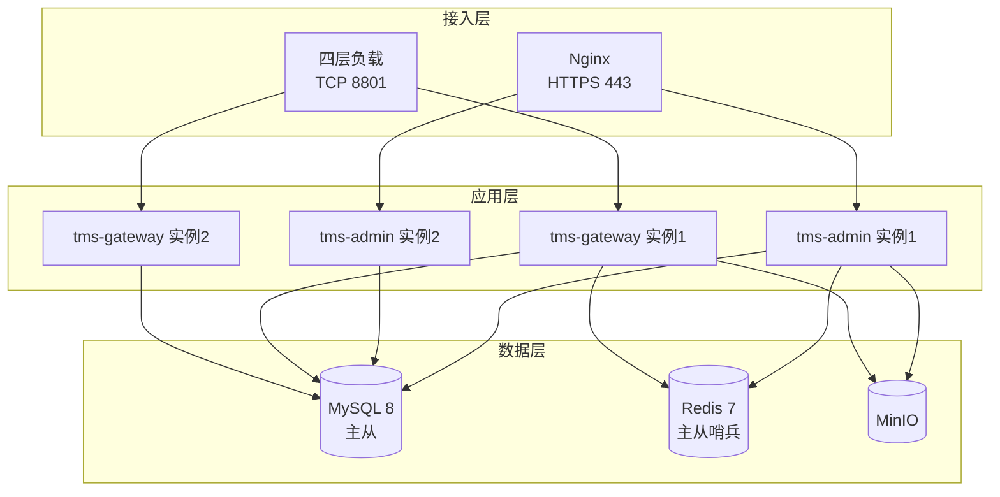

`tms-admin` 无状态，可任意扩容。`tms-gateway` 的握手与认证上下文绑定 TCP 连接，同一次激活或 RKI 流程天然落在同一实例，四层负载不需要额外的会话保持配置。

### 8.2 服务组件

| 组件 | 版本 | 端口 | 说明 |
|---|---|---|---|
| Nginx | 1.24+ | 443 | 前端静态资源与后台接口反向代理，管理后台 HTTPS 证书在此终止 |
| tms-admin | — | 8080 | 管理后台进程，前端页面由 Nginx 托管 |
| tms-gateway | — | 8801 | 设备 TCP 接入 |
| MySQL | 8.0 | 3306 | 主从，从库承担报表与导出查询 |
| Redis | 7.x | 6379 | 主从加哨兵 |
| MinIO | 最新稳定版 | 9000 | 单节点或分布式，按客户数据量选择 |
| SMTP | — | — | 客户提供；不启用邮件时授权码渠道只能用 `TOOL` |

私有化交付物：两个可执行 JAR、前端静态资源包、数据库初始化脚本、配置模板、部署说明。

### 8.3 核心配置

| 配置项 | 默认值 | 说明 |
|---|---|---|
| `tms.session.idle-timeout` | 30m | 会话滑动有效期 |
| `tms.session.max-lifetime` | 12h | 会话绝对有效期 |
| `tms.security.login-fail-threshold` | 5 | 连续登录失败锁定阈值 |
| `tms.security.lock-duration` | 15m | 账号锁定时长 |
| `tms.auth-code.expire` | 10m | 一次性授权码过期时间 |
| `tms.auth-code.default-channel` | `TOOL` | 授权码发放渠道默认值，客户级可覆盖 |
| `tms.activation.handshake-timeout` | 5m | A0 响应后等待 A1 的时限 |
| `tms.rki.download-timeout` | 10m | A2 完成后 A3 密钥下载时限 |
| `tms.rki.max-resend` | 3 | 同一密钥最大重发次数 |
| `tms.gateway.port` | 8801 | 设备接入端口 |
| `tms.gateway.idle-timeout` | 60s | 连接空闲断开时间 |
| `tms.message-log.retention-days` | 30 | 设备报文记录保留天数 |
| `tms.active-day.retention-days` | 90 | 日活明细保留天数 |
| `tms.stat.daily-rollup-cron` | `0 10 0 * * ?`（UTC） | 日活汇总时间 |
| `tms.storage.endpoint` | — | MinIO 地址 |
| `tms.crypto.master-key` | — | 私钥加密的主密钥，从环境变量或独立密钥文件读取，不写入配置文件 |

定时任务清单：日活汇总、过期会话清理、过期授权码清理、报文记录分区维护、接口访问日志清理、证书到期扫描。

---

## 9. 附录

### 9.1 术语表

| 术语 | 说明 |
|---|---|
| TMS | Terminal Management System，终端管理系统 |
| SN | 设备序列号，全系统唯一的设备标识 |
| 客户 / 租户 | 使用本系统的银行或支付机构，数据隔离单位 |
| 机构 | 客户内部的组织层级，设备归属与数据范围的基准单位 |
| OTA | Over-The-Air，远程升级 |
| RKI | Remote Key Injection，远程密钥注入 |
| KDH | Key Distribution Host，密钥分发主机，本系统承担该角色 |
| TR-31 | ANSI X9 TR-31 密钥块格式 |
| KBPK | Key Block Protection Key，密钥块保护密钥，本方案为 AES-256 |
| KEK | Key Encryption Key，密钥加密密钥 |
| KCV | Key Check Value，密钥校验值，本方案取 3 字节显示为 6 位十六进制 |
| TMK | Terminal Master Key，终端主密钥，对应 MK/SK 体系 |
| IPEK | Initial PIN Encryption Key，DUKPT 体系的初始密钥 |
| KSN | Key Serial Number，DUKPT 密钥序列号 |
| DUKPT | Derived Unique Key Per Transaction |
| TransKey | 终端与平台协商的传输密钥，`RandomA xor RandomB` |
| 授权码 | 一次性设备激活授权码，一码一机一次会话 |
| 防拆 | 设备物理拆解检测，触发后自毁密钥并需防拆激活恢复 |
| 数据范围 | 成员能访问的机构范围，取值见 6.2.10 |
| 关联编号 | `trace_id`，串联接口访问日志、操作日志与设备报文记录 |

### 9.2 错误码

格式为 `模块前缀_三位序号`。HTTP 状态码表达大类，业务错误码表达具体原因。

错误码枚举按模块归属：`COMMON_` 与 `PERM_` 在 `tms-common`（基础设施与各模块共同使用），`AUTH_`、`TENANT_`、`ORG_`、`MEMBER_`、`ROLE_`、`SESSION_` 在 `tms-core.iam`，`PRODUCT_` 在 `tms-core.product`。

| 错误码 | HTTP | 说明 |
|---|---|---|
| `COMMON_001` | 400 | 参数校验失败 |
| `COMMON_002` | 409 | 数据已被其他人修改，请刷新后重试 |
| `COMMON_003` | 404 | 资源不存在 |
| `COMMON_004` | 503 | 依赖服务不可用 |
| `COMMON_005` | 500 | 系统内部错误 |
| `AUTH_001` | 400 | 账号或密码错误 |
| `AUTH_002` | 400 | 账号已停用 |
| `AUTH_003` | 400 | 账号已锁定 |
| `AUTH_004` | 401 | 登录已失效，请重新登录 |
| `AUTH_005` | 400 | 需要先修改初始密码 |
| `AUTH_006` | 400 | 原密码错误 |
| `AUTH_007` | 400 | 邮箱未验证，无法使用邮件找回 |
| `PERM_001` | 403 | 无此操作权限 |
| `PERM_002` | 403 | 超出数据范围 |
| `PERM_003` | 400 | 包含无权授予的权限项 |
| `PERM_004` | 400 | 该功能未对客户开通 |
| `TENANT_001` | 400 | 客户名称已存在 |
| `TENANT_002` | 400 | 型号仍有归属设备，不能取消关联 |
| `TENANT_003` | 400 | 存在设备、任务或下级机构，不能删除 |
| `ORG_001` | 400 | 同级机构名称已存在 |
| `ORG_002` | 400 | 上级机构不可用或超出可管理范围 |
| `ORG_003` | 400 | 存在成员、设备、任务或下级机构，不能删除 |
| `ORG_004` | 400 | 根机构不可停用或删除 |
| `MEMBER_001` | 400 | 账号已存在 |
| `MEMBER_002` | 400 | 账号格式不合法 |
| `MEMBER_003` | 400 | 邮箱已被绑定 |
| `MEMBER_004` | 400 | 至少选择一个角色 |
| `MEMBER_005` | 400 | 不能移除本机构最后一名管理员的管理权限 |
| `ROLE_001` | 400 | 角色名称已存在 |
| `ROLE_002` | 400 | 内置角色不可修改 |
| `ROLE_003` | 400 | 角色已被成员引用，不能删除 |
| `SESSION_001` | 400 | 会话已失效 |
| `SESSION_002` | 400 | 请填写下线原因 |
| `SESSION_003` | 400 | 不能强制下线当前会话 |
| `PRODUCT_001` | 400 | 型号标识已存在 |
| `PRODUCT_002` | 400 | 型号已被引用，不能移除 |

业务模块错误码在下一轮随对应模块补充，前缀预留：`DEVICE_`、`STOCK_`、`GROUP_`、`TASK_`、`PKG_`、`KEY_`、`GRANT_`、`CODE_`、`ACT_`、`CA_`、`CERT_`。

设备侧响应码不使用本表，取自 `docs/protocol/README.md` 的全局响应码表；平台内部错误统一映射为 `05 系统忙`。

### 9.3 待确认事项

以下事项在与终端方确认前按“暂定方案”实现，不阻塞开发。前三项是本轮阅读协议文档新发现的问题，`docs/protocol/README.md` 尚未记录。

| 编号 | 问题 | 影响范围 | 暂定方案 |
|---|---|---|---|
| A | `msgLength` 编码矛盾：OTA 文档写 `String/2`（ASCII 两位最大表示 99），激活文档写 `HEX/2`；且未说明长度是否包含自身与 LRC | 阻塞 Netty 解码器实现，影响全部 8 条命令 | 统一按 2 字节无符号大端二进制，长度值 = 命令码 + 报文信息 + LRC 的字节数。参数集中在一个常量类，确认后单点修改 |
| B | 更新接口（10）响应报文有 `softTaskId` 与 `paramTaskId`，**缺少 KernelTaskId**；但下载请求（11）`type=2` 必传 `taskId`，安装完成通知（12）也带 `KernelTaskId` | Kernel 升级任务无法下发任务号，OTA 三类任务中 Kernel 链路不完整 | 在更新响应报文中追加 8 字节 `KernelTaskId`，位置紧随 `KernelVersion` 之后。属协议变更，须终端方确认 |
| C | `posCATI`（POS 终端号，8 字节）在功能清单中没有对应概念，全系统以 SN 作为设备标识 | 若确需终端号，设备表需增加字段且入库流程需分配逻辑 | 作为兼容字段：接入层解析但不参与业务判定，设备识别一律用 SN |
| D | 字段命名错位：下载请求与激活报文的命令码字段写作 `responseCode`，激活响应出现两行 `orderCode` | 编解码实现 | 按位置而非字段名对齐，见 5.9.1 |
| E | A0 响应的 `CipherData` 描述为「用密钥 K 对 M 进行 AES 加密」，K 未定义 | A0 响应加密实现 | 按上下文取终端上送的 TransKey |
| F | 终端状态 4 字节编码未给出取值定义，协议正文只举例 debug／product／Lock／factory | 激活、密钥下载、状态设置三处报文 | 暂定 `0x00000001` 工厂、`0x00000002` 调试、`0x00000003` 产品、`0x00000004` 锁定 |
| G | A3 请求密文长度：明文 32 字节，现有终端实现密文 48 字节，工作模式、IV 与补位方案未提供 | A3 解密实现 | 按 AES 带整块补位实现，具体参数待终端侧提供现有代码后确认，服务端实现以代码为准 |
| H | `KeyType` 位段 bit4—6、bit13—15 未定义 | 认证接口密钥标志解析 | 保留位一律置 0，收到非 0 时忽略并记录告警 |
| I | 签到接口未定稿：OTA 文档目录含该接口，正文为空；接口列表未含命令码 13 | 本期功能范围 | 本期不实现签到接口，命令码 13 按「终端状态设置」实现 |
| J | RKI 方案正文称「向终端分配三种密钥」，随后列出 DUKPT IPEK、MK、Fixed Key、RSA Key 四项 | 密钥类型枚举 | 按 6.3.16 的三种密钥类型实现；RSA Key 为激活阶段下发的身份密钥对，不属于密钥导入范围 |
| K | 私有化部署时终端预置的 CA 公钥归属未定：客户实例自行生成 CA 会导致存量终端 A0 验签与 A2 认证失败 | 私有化交付方案 | 作为部署前置条件：私有化实例必须导入与终端预置公钥配套的 CA 密钥对（3.19 的导入密钥对功能）。是否支持按客户定制预置或证书链验证，待与终端方确认 |
